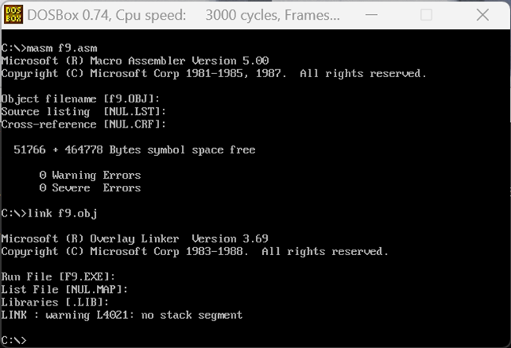

# 计算机组成原理第二次实验报告

## 一、前言

计算机组成原理这门课旨在让学生了解计算机的组成结构与基本运作原理，并且拥有能力设计CPU与指令集，因此汇编语言编写的学习至关重要。本节实验课使用MARS4.5软件与DOSBox0.74软件分别使用MIPS指令集与80x86指令集输出“Hello,World!“与自己的姓名与学号，初步了解这两个指令集的运用与对应的两个模拟器软件的使用，为之后设计自己的指令集打下基础。

## 二、实验过程

### 2.1 MIPS指令集实验

#### 2.1.1 MARS4.5软件介绍

MARS是一个由JAVA编写的MIPS模拟器，基于JAVA驱动，具有文件小，免安装使用等优点。本次实验使用该模拟器进行MIPS指令集的学习，软件界面如图1。


#### 2.1.2 Hello World输出

新建一个编程文件，编写相应的代码，代码如表1展示。

```assembly
1.	.data
2.	out_string: .asciiz"\nHello World!\n\n"
3.	.text
4.	main:
5.	li $v0,4
6.	la $a0,out_string
7.	syscall
8.	li $v0,4
9.	la $a0,out_string
10.	syscall
11.	li $v0,10
12.	syscall
```

编写完成之后，进行反汇编操作，得到内存的使用情况如图2展示。


可以看到，在首行内存中，存储了相对应指令的机器码，其中每三十二位对应一条指令，即两位十六进制数。

运行该程序，得到输出。


#### 2.1.3 学号姓名输出

操作过程与上述过程并无太大区别，源代码如表2，操作流程图如图4。

```assembly
1.	.data
2.	out_string: .asciiz"\nSoliTa,114514\n\n"
3.	.text
4.	main:
5.	li $v0,4
6.	la $a0,out_string
7.	syscall
8.	li $v0,4
9.	la $a0,out_string
10.	syscall
11.	li $v0,10
12.	syscall
```

### 2.2 80x86指令集实验

#### 2.2.1 DOSBox0.74软件介绍

DOSBox0.74是一款非常精简的DOS模拟器，提供了相应的80x86编程环境，使用者可以在类型命令行窗口的界面中输入相应的代码，或者打开某个文件进入精简的图形窗口中实现宏汇编，操作与易用性都有所提升。软件界面如图6所示。


#### 2.2.2 Hello World输出

DOSBox中没有图形界面，所以新建文件需要使用edit指令，以打开一个文件的形式创建一个文件并进入宏汇编模式。输入

```assembly
edit f9.asm
```

回车便进入宏汇编模式，如图7。


在这个模式下，鼠标光标有感应，对编写长代码较为方便。

为实现输出Hello World代码，需要把字符串放在data块中声明，同时声明CS段为代码段，DS段为数据段，然后将数据移存至AX累加器中，然后把数据再通过AX存储进DS中，实现数据的存储，最后调用INT 21中的库函数，使用mov AH,9将数据移动至输出端输出，最后让程序返回操作系统。为了输出效果明显，数据段经过了三次输出，具体的代码实现如图8所示。


完成代码后，在宏汇编界面中直接保存退出，返回到命令行窗口，然后通过masm

指令编译程序。再输入masm f9.asm，系统会生成obj文件，同时返回警告与报错信息，如图9所示。


将可执行文件连接到DOSBox中，使用link指令传入DOSBox中，如图10所示。



后直接输入文件名f9，可以看到程序被执行，成功打印出3行hello world，如图11。

