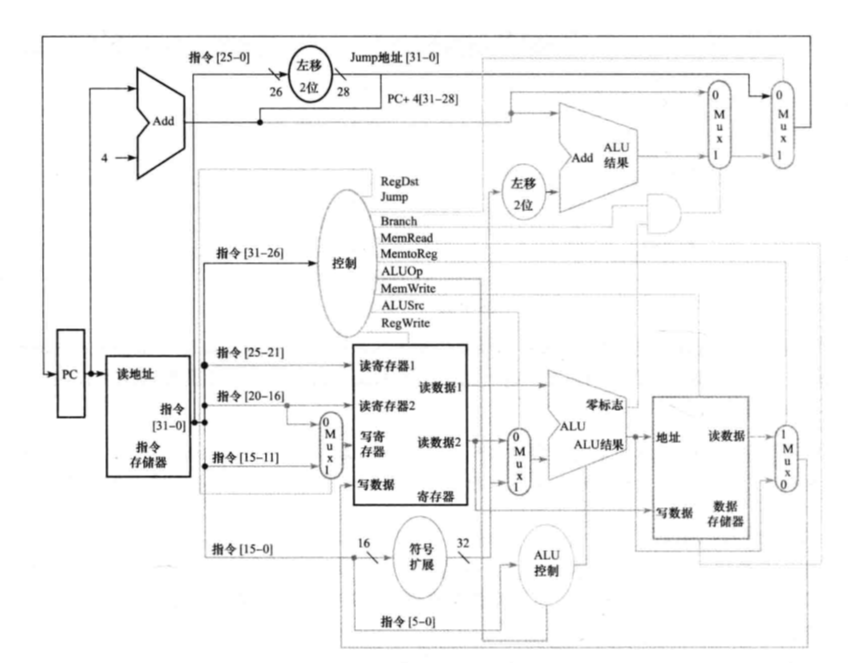
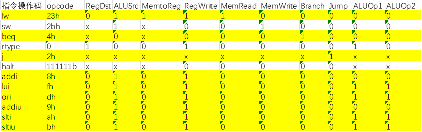
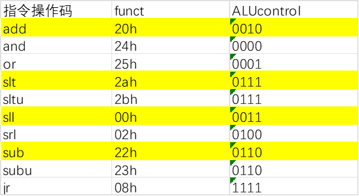
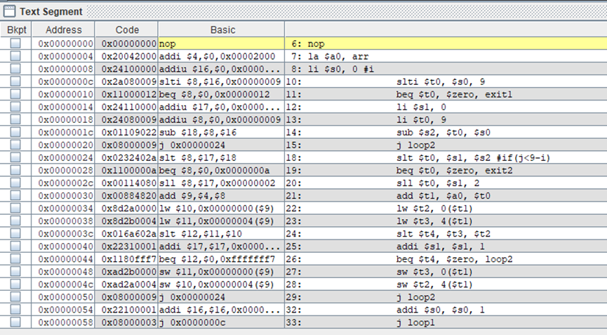
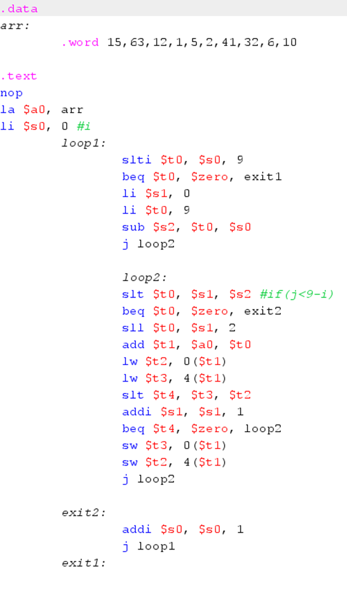

# 计算机组成原理第五次实验报告

## 一、前言

这一次实验要求我利用VIVADO与开发板实现单周期CPU的制作。最后本人历时接近两周，最终完成了需求。完成之后的CPU可以根据开发板上的十六位拨码开关输入数据，按左右的拨片来切换寄存器，按最下面的拨片确定输入，最后按中间的拨片完成冒泡排序，完成冒泡排序之后亮起相应的指示灯，表明排序完成。排序完成之后可以按左右拨片来切换寄存器，确定是否完成了冒泡排序。

## 二、实验过程

### 2.1 指令集设计

本次实验设计基于书本上的单周期CPU结构，最基本的元件包含了PC（当前指令地址），IM（指令寄存器），Register（寄存器堆），ALL_Control（控制），ALU（通用运算器），Data Memory（内存）。除此以外，还有一些未标注出来的部件，如图所示。



基于该CPU可以实现R型指令，lw，sw，beq与jump指令。但是冒泡排序中还有很多I型指令存在，需要在此基础上重新设计指令-控制信号表。最后，根据最后我的冒泡排序的指令以及MARS编译器编译生成的结果，我额外补充了必须的的指令设计，如下表所示。所有在MIPS中已经有的指令我都严格按照MIPS中的指令来确定向量表。同时我自己设计了停机指令0xffffffff，为了在运行结束之后让PC不再改变。

- 表1 控制信号的含义



- 表2 指令-控制信号对应表


- 表3 ALU_Control对应表


- 表4 R型指令funct-ALUcontrol对应表（标黄为实现了的指令）



那我是怎么确认我需要用到哪些指令地呢？我使用了MARS编译器地一些功能。首先我先编写了MIPS版本地冒泡排序程序，然后我使用MARS编译内容，从而得到了相关的真实代码与机器码。如图所示，从左到右分别提供了代码的真实地址位置，代码的机器码，编译后可直接执行的指令与原本夹杂着伪指令的代码。



还有一点，在Setting->Memory Configuration中，还可以直接修改代码段与数据段的地址，这样在导出机器码的时候代码段的数据就不用修改了，直接就是从0开始。数据段经我修改之后，起始位置在0x00002000中，因此我在后面的代码中也特意对每一次取值都减去了0x00002000。

这次冒泡程序的源代码如下：

需要注意的是，最后需要在导出的机器码的最后手动输入停机指令0xffffffff。



### 2.2 各部件实现

#### 2.2.1 PC模块

```verilog
1.	module PC_real(
2.	    input CLK,
3.	    input [31:0]PC_in,
4.	    output reg [31:0]PC_out
5.	    );
6.	    
7.	    initial begin
8.	        PC_out=0;
9.	    end
10.	    
11.	    always@(posedge CLK)begin
12.	        PC_out<=PC_in;
13.	    end
14.	    
15.	endmodule
```

#### 2.2.1  PC_changer模块

为了方便，本次实验我把所有的对PC改变的操作都放入了一个模块里进行操作。在这里有两个重要的地方：第一个是慎用posedge CLK，也就是不要乱用时钟来控制输入输出命令。因为这可能会导致不同模块之间的执行是按时序执行而不是同时全部执行。第二点是阻塞赋值与非阻塞赋值的运用。在大部分情况下，非阻塞赋值能够帮助CPU以更快的速度运行。但是如果指令中有部分赋值指令具有前后逻辑关系的时候就必须使用阻塞赋值。

```verilog
1.	module PC_changer(
2.	    input [31:0]instruction,
3.	    input [31:0]PC,
4.	    input CLK,
5.	    input Jump,
6.	    input Branch,
7.	    input [25:0]JAdd,
8.	    input ALUzero,
9.	    input [31:0]ExBeq,
10.	    input start,
11.	    output reg [31:0] nextPC,
12.	    output reg realstart,
13.	    output reg finish
14.	    );
15.	    
16.	    reg [31:0]CurPC;
17.	    reg [31:0]ExJAdd;
18.	    reg [31:0]ExBeqAdd;
19.	    
20.	    initial begin
21.	        nextPC=0;
22.	        CurPC=0;
23.	        realstart=0;
24.	        finish=0;
25.	    end
26.	    
27.	    always@(*)begin
28.	        if(start==1) realstart=1;
29.	    end
30.	    
31.	    always@(*) begin
32.	        if(realstart==1 || PC!=0) begin
33.	            if(instruction==32'hffffffff) finish=1;
34.	            else begin
35.	                CurPC <= PC+4;
36.	                ExJAdd = JAdd<<2;
37.	                ExJAdd <= {CurPC[31:28],ExJAdd[27:0]};
38.	                ExBeqAdd <= CurPC + (ExBeq<<2);
39.	                if(Branch == 1 && ALUzero == 1) nextPC <= ExBeqAdd;
40.	                else begin
41.	                    if(Jump == 1) nextPC <= ExJAdd;
42.	                    else nextPC <= CurPC;
43.	                end 
44.	            end
45.	        end
46.	    end
47.	    
48.	endmodule
```

#### 2.2.3 IM模块

```verilog
1.	module IM(
2.	    input [31:0]ReadAddress,
3.	    output [31:0] Instruction
4.	    );
5.	    reg [7:0] memory[0:8'hff];
6.	    
7.	    initial begin
8.	        $readmemh("D:/hexcode",memory,0);
9.	    end
10.	    
11.	    assign Instruction[31:24] = memory[ReadAddress];
12.	    assign Instruction[23:16] = memory[ReadAddress+1];
13.	    assign Instruction[15:8] = memory[ReadAddress+2];
14.	    assign Instruction[7:0] = memory[ReadAddress+3];
15.	
16.	       
17.	endmodule
```

本模块其实还有改进的余地：在最开始我严格按照标准MIPS的要求来制作CPU（因为最开始我对CPU的运行原理还不太懂），于是将所有的内存都设置为了8位，每一次操作都得进行四次操作。但是在最后我发现完全可以定义32位的内存，只用一次操作就能实现现在四步操作才能实现的功能。

#### 2.2.4 ALLControl模块

```verilog
1.	module All_Control(
2.	    input [5:0]opcode,
3.	    output reg RegDst,
4.	    output reg Branch,
5.	    output reg MemRead,
6.	    output reg MemtoReg,
7.	    output reg [1:0]ALUop,
8.	    output reg MemWrite,
9.	    output reg Jump,
10.	    output reg ALUSrc,
11.	    output reg RegWrite
12.	    );
13.	    
14.	    always@(*) begin
15.	        if(opcode==6'h23) begin //lw
16.	            RegDst <= 0;
17.	            ALUSrc <= 1;
18.	            MemtoReg <= 1;
19.	            RegWrite <= 1;
20.	            MemRead <= 1;
21.	            MemWrite <= 0;
22.	            Branch <= 0;
23.	            Jump <= 0;
24.	            ALUop <= 2'b00;
25.	        end
26.	        if(opcode==6'h2b) begin //sw
27.	            ALUSrc <= 1;
28.	            RegWrite <= 0;
29.	            MemRead <= 0;
30.	            MemWrite <= 1;
31.	            Branch <= 0;
32.	            Jump <= 0;
33.	            ALUop <= 2'b00;
34.	        end
35.	        if(opcode==6'h4) begin //beq
36.	            ALUSrc <= 0;
37.	            RegWrite <= 0;
38.	            MemRead <= 0;
39.	            MemWrite <= 0;
40.	            Branch <= 1;
41.	            Jump <= 0;
42.	            ALUop <= 2'b00;
43.	        end
44.	        if(opcode==0) begin //rtype
45.	            RegDst <= 1;
46.	            ALUSrc <= 0;
47.	            MemtoReg <= 0;
48.	            RegWrite <= 1;
49.	            MemRead <= 0;
50.	            MemWrite <= 0;
51.	            Branch <= 0;
52.	            Jump <= 0;
53.	            ALUop <= 2'b10;
54.	        end
55.	        if(opcode==6'h2) begin //j
56.	            RegWrite <= 0;
57.	            MemRead <= 0;
58.	            MemWrite <= 0;
59.	            Branch <= 0;
60.	            Jump <= 1;
61.	        end
62.	        if(opcode==6'h8 || opcode==6'h9) begin //addi,addiu
63.	            RegDst <= 0;
64.	            ALUSrc <= 1;
65.	            MemtoReg <= 0;
66.	            RegWrite <= 1;
67.	            MemRead <= 0;
68.	            MemWrite <= 0;
69.	            Branch <= 0;
70.	            Jump <= 0;
71.	            ALUop <= 2'b00;
72.	        end
73.	        if(opcode==6'hf || opcode==6'hd || opcode==6'ha || opcode==6'hb) begin //lui,ori,slti,sltiu
74.	            RegDst <= 0;
75.	            ALUSrc <= 1;
76.	            MemtoReg <= 0;
77.	            RegWrite <= 1;
78.	            MemRead <= 0;
79.	            MemWrite <= 0;
80.	            Branch <= 0;
81.	            Jump <= 0;
82.	            ALUop <= 2'b11;
83.	        end
84.	
85.	        if(opcode==6'b111111) begin //halt
86.	            RegWrite <= 0;
87.	            MemRead <= 0;
88.	            MemWrite <= 0;
89.	            Branch <= 0;
90.	            Jump <= 0;
91.	        end
92.	    end
93.	endmodule
```

如代码所见，这个模块作用是将指令转换成相映的控制命令。这个时候，最开始苦苦建立的向量表在这里就起了很大的作用。

#### 2.2.5 DM模块

```verilog
1.	module DM(
2.	    input CLK,
3.	    input realstart,
4.	    input enter,
5.	    input finish,
6.	    input left,
7.	    input right,
8.	    input [31:0]shuru,
9.	    input [31:0]Address,
10.	    input [31:0]WriteData,
11.	    input MemRead,
12.	    input MemWrite,
13.	    output reg [31:0]ReadData,
14.	    output reg [31:0]num1,
15.	    output reg [31:0]num2,
16.	    output reg [31:0]num3,
17.	    output reg [31:0]num4,
18.	    output reg [31:0]num5,
19.	    output reg [31:0]num6,
20.	    output reg [31:0]num7,
21.	    output reg [31:0]num8,
22.	    output reg [31:0]num9,
23.	    output reg [31:0]num10,
24.	    output reg [31:0]curnum,
25.	    output reg [4:0]regname
26.	    );
27.	    reg [7:0] ram[0:100];
28.	    integer i;
29.	    integer j=0;
30.	    reg tem;
31.	    
32.	    //此次实验使用的data地址为0x00002000
33.	    
34.	    initial begin
35.	        //$readmemh("D:/hexdata",ram);
36.	        regname=0;
37.	        tem=0;
38.	    end
39.	
40.	    always@(posedge CLK)begin
41.	            if(left==1 && tem==0) begin
42.	                regname=regname-1;
43.	                if(regname>=10) regname=9;
44.	                tem<=1;
45.	            end
46.	            else if(right==1 && tem==0) begin
47.	                regname=regname+1;
48.	                if(regname>=10) regname=0;
49.	                tem<=1;
50.	            end
51.	            else if(left==0 && right==0 && tem==1) tem=0;
52.	    end
53.	    
54.	    always@(posedge CLK)begin
55.	        curnum[31:24]<=ram[regname*4];
56.	        curnum[23:16]<=ram[regname*4+1];
57.	        curnum[15:8]<=ram[regname*4+2];
58.	        curnum[7:0]<=ram[regname*4+3];
59.	    end
60.	    
61.	    always@(*) begin
62.	        if(MemRead==1) begin
63.	            ReadData[31:24] <= ram[Address-32'h00002000];
64.	            ReadData[23:16] <= ram[Address+1-32'h00002000];
65.	            ReadData[15:8] <= ram[Address+2-32'h00002000];
66.	            ReadData[7:0] <= ram[Address+3-32'h00002000];
67.	        end
68.	    end    
69.	    
70.	    always@(posedge CLK)begin
71.	        if(MemWrite==1) begin
72.	            ram[Address-32'h00002000] <= WriteData[31:24];
73.	            ram[Address+1-32'h00002000] <= WriteData[23:16];
74.	            ram[Address+2-32'h00002000] <= WriteData[15:8];
75.	            ram[Address+3-32'h00002000] <= WriteData[7:0];
76.	        end
77.	        else if(enter==1 && finish==0)begin
78.	            ram[regname*4] <= shuru[31:24];
79.	            ram[regname*4+1] <= shuru[23:16];
80.	            ram[regname*4+2] <= shuru[15:8];
81.	            ram[regname*4+3] <= shuru[7:0];
82.	        end
83.	    end
84.	    
85.	    always@(*) begin
86.	        num1[31:24] <= ram[0];
87.	        num1[23:16] <= ram[1];
88.	        num1[15:8] <= ram[2];
89.	        num1[7:0] <= ram[3];
90.	        num2[31:24] <= ram[4];
91.	        num2[23:16] <= ram[5];
92.	        num2[15:8] <= ram[6];
93.	        num2[7:0] <= ram[7];
94.	        num3[31:24] <= ram[8];
95.	        num3[23:16] <= ram[9];
96.	        num3[15:8] <= ram[10];
97.	        num3[7:0] <= ram[11];
98.	        num4[31:24] <= ram[12];
99.	        num4[23:16] <= ram[13];
100.	        num4[15:8] <= ram[14];
101.	        num4[7:0] <= ram[15];
102.	        num5[31:24] <= ram[16];
103.	        num5[23:16] <= ram[17];
104.	        num5[15:8] <= ram[18];
105.	        num5[7:0] <= ram[19];
106.	        num6[31:24] <= ram[20];
107.	        num6[23:16] <= ram[21];
108.	        num6[15:8] <= ram[22];
109.	        num6[7:0] <= ram[23];
110.	        num7[31:24] <= ram[24];
111.	        num7[23:16] <= ram[25];
112.	        num7[15:8] <= ram[26];
113.	        num7[7:0] <= ram[27];
114.	        num8[31:24] <= ram[28];
115.	        num8[23:16] <= ram[29];
116.	        num8[15:8] <= ram[30];
117.	        num8[7:0] <= ram[31];
118.	        num9[31:24] <= ram[32];
119.	        num9[23:16] <= ram[33];
120.	        num9[15:8] <= ram[34];
121.	        num9[7:0] <= ram[35];
122.	        num10[31:24] <= ram[36];
123.	        num10[23:16] <= ram[37];
124.	        num10[15:8] <= ram[38];
125.	        num10[7:0] <= ram[39];
126.	    end
127.	    
128.	endmodule
```

在该模块中有一些只用于仿真的变量：num1~num10。这些变量在实际烧写到板子上的时候并没有实际使用，而只是在仿真的时候方便查看数组每一个元素的变化（因为我的内存设计是8字节的，因此直接查看DM内存的内容有点困难，这实际上可以在最开始的IM模块改进），为了防止注释掉之后代码出问题，我选择了将这段无用代码留在文件中。同时，这里的initial模块中有一段被注释掉的代码，这个也是在仿真中使用的代码，意为在仿真中初始化内存中的值，方便在仿真中确认CPU是否成功运行。不过最后在烧写到板上的时候，内存中的值应该直接从板上输入。

同时，考虑到最后板子上要显示相应内存地址存储的内容，同时还要用不同的LED灯显示具体的序号，因此这个DM同时加入了一些按钮的输入，并实现了对应的内容。

#### 2.2.6 Sign-extend模块

这个模块是为了将立即数偏移量地址扩展到32位。

```verilog
1.	module Sign_extend(
2.	    input [15:0]Ins16,
3.	    input [5:0]opcode,
4.	    output reg [31:0] Ins32
5.	    );
6.	    
7.	    always@(*) begin
8.	        if(opcode==6'hf) Ins32 <= {Ins16,16'b0};
9.	        else begin
10.	            if(Ins16[15:15]==0)Ins32 <= {16'b0,Ins16};
11.	            else Ins32 <= {16'hffff,Ins16};
12.	        end
13.	        
14.	    end
15.	    
16.	endmodule
```

#### 2.2.7 ALU模块

```verilog
1.	module ALU(
2.	    input [4:0] shamt,
3.	    input [31:0] in0,
4.	    input [31:0] in1,
5.	    input [3:0] ALUcontrol,
6.	    output reg [31:0] result,
7.	    output zero
8.	    );
9.	    
10.	    always@(*) begin
11.	        case(ALUcontrol)
12.	            4'b0010: result <= in0+in1;
13.	            4'b0110: result <= in0-in1;
14.	            4'b0000: result <= in0&in1;
15.	            4'b0001: result <= in0|in1;
16.	            4'b0111: result <=(in0<in1)?1:0;
17.	            4'b0011: result <= in1<<shamt;
18.	            4'b0100: result <= in0>>>in1;
19.	            4'b1111: result <= in1;
20.	            default: result <= 0;
21.	        endcase
22.	    end
23.	    assign zero = (in0==in1)?1:0;
24.	    
25.	endmodule
```

这个模块比较重要的一点是，这个模块的加减法要和之前建立的指令表对应起来。这个对应的顺序是指令->ALUop->ALUControl。

#### 2.2.8 Registers模块

```verilog
1.	module Registers(
2.	    input CLK,
3.	    input [4:0]ReadReg1,
4.	    input [4:0]ReadReg2,
5.	    input [4:0]WriteReg,
6.	    input [31:0]WriteData,
7.	    input RegWrite,
8.	    output [31:0]ReadData1,
9.	    output [31:0]ReadData2
10.	    );
11.	    reg [31:0] regist[0:31];
12.	    integer i;
13.	    
14.	    initial
15.	    begin
16.	        for(i=0; i<32; i=i+1)
17.	            regist[i] = 0;
18.	    end
19.	    
20.	    always@(negedge CLK) begin
21.	        if(RegWrite==1) begin
22.	            regist[WriteReg] <= WriteData;
23.	        end
24.	    end
25.	
26.	    assign ReadData1 = regist[ReadReg1];
27.	    assign ReadData2 = regist[ReadReg2];
28.	    
29.	endmodule
```

这个模块存储了32个寄存器。如何实现不同的指令读写不同的寄存器？MARS编译器可以导出二进制机器码或者十六进制机器码，编译好的程序已经自动安排好了所有寄存器的实际编号和所有指令的实际机器码，只要IM模块初始化时导入了这些实际指令，就可以按秩序执行指令。

以上是所有重要的模块。其中为了让这个CPU彻底运行起来，还需要有一些琐碎的模块，以下是这些具体的细节与实现。

#### 2.2.9 Mux_WriteRegister模块

```verilog
1.	module Mux_WriteRegister(
2.	    input [4:0]rt,
3.	    input [4:0]rd,
4.	    input RegDst,
5.	    output reg [4:0]result
6.	    );
7.	    
8.	    always@(*) begin
9.	        if(RegDst==0) result <= rt;
10.	        else result <= rd;
11.	    end
12.	endmodule
```

这个模块之所以独立于一般的Mux模块，因为输入输出都是5位的，所以特别制作了一个5位的选择器。

#### 2.2.10 Mux2_32bit模块

```verilog
1.	module Mux2_32bit(
2.	    input [31:0] Data1,
3.	    input [31:0] Data2,
4.	    input Sel,
5.	    output reg [31:0] Result
6.	    );
7.	    
8.	    always@(*) begin
9.	        if(Sel == 0)
10.	            Result <= Data1;
11.	        else
12.	            Result <= Data2;
13.	    end
14.	    
15.	endmodule
```

#### 2.2.11 Input模块

```verilog
1.	module Input(
2.	    input CLK,
3.	    input enter,
4.	    input [15:0]InputNum,
5.	    output reg [31:0] shuru
6.	    );
7.	    
8.	    initial begin
9.	        
10.	    end
11.	    
12.	    always@(posedge CLK)begin
13.	        if(enter==1) shuru<=InputNum;
14.	    end
15.	    
16.	endmodule
```

这个模块能够将输入的数输出到板子上，是为了让DM模块不要集成太多的功能，防止出问题的时候任务过于繁重。

#### 2.2.12 CLK_div模块

```verilog
1.	module CLK_div #(parameter N=99)(
2.	    input CLK,
3.	    output CLKout
4.	    );
5.	    
6.	    reg [31:0]count=0;
7.	    reg out=0;
8.	    
9.	    always@(posedge CLK)begin
10.	        if(count==N)begin
11.	            count<=0;
12.	        end
13.	        else begin
14.	            count<=count+1;
15.	        end
16.	    end
17.	    
18.	    always@(posedge CLK)begin
19.	    if(count==N-1) out<=!out;
20.	    end
21.	    
22.	    assign CLKout=out;
23.	endmodule
```

这个模块最开始是为了让LED以及显示管能够正常工作。但是之后有同学提醒说单周期CPU有可能时钟间隔太短，因此我后来所有的模块接入的所有CLK都是分频过后的CLK。

#### 2.2.13 LED模块

```verilog
1.	module LED(
2.	    input realstart,
3.	    input CLK,
4.	    input [4:0]regname,
5.	    input finish,
6.	    output reg [9:0] LED10,
7.	    output reg LEDfinish
8.	    );
9.	    
10.	    initial begin
11.	        LEDfinish=0;
12.	    end
13.	    
14.	    always@(posedge CLK)begin
15.	        if(finish==0 && realstart==1) LED10=10'b0000000000;
16.	        else begin
17.	            case(regname)
18.	                0:LED10=10'b1000000000;
19.	                1:LED10=10'b0100000000;
20.	                2:LED10=10'b0010000000;
21.	                3:LED10=10'b0001000000;
22.	                4:LED10=10'b0000100000;
23.	                5:LED10=10'b0000010000;
24.	                6:LED10=10'b0000001000;
25.	                7:LED10=10'b0000000100;
26.	                8:LED10=10'b0000000010;
27.	                9:LED10=10'b0000000001;
28.	            endcase
29.	        end
30.	        if(finish==1) LEDfinish=1;
31.	    end
32.	    
33.	endmodule
```

#### 2.2.14 显示模块

```verilog
1.	module xianshi(
2.	    input realstart,
3.	    input finish,
4.	    input CLK,
5.	    input [31:0] Data,
6.	    output reg [3:0] seg,
7.	    output reg [6:0] a_to_g
8.	    );
9.	    
10.	    reg [3:0] temp;
11.	    reg [7:0] x;
12.	    
13.	    initial begin
14.	        temp=0;
15.	        x=0;
16.	    end
17.	    
18.	    always@(posedge CLK) begin
19.	        case (temp)
20.	                0: begin x = Data/4096; seg = 4'b0111; end
21.	                1: begin x = Data/256%16; seg = 4'b1011; end
22.	                2: begin x = Data/16%16; seg = 4'b1101; end
23.	                3: begin x = Data%16; seg = 4'b1110; end
24.	        endcase
25.	        temp = temp + 1;
26.	        if (temp == 4)
27.	            temp = 0;
28.	    end
29.	    
30.	    always@(*) begin
31.	        if(realstart==1&&finish==0) a_to_g = 7'b1111111;
32.	        else begin
33.	            case (x)
34.	                0: a_to_g = 7'b0000001;
35.	                1: a_to_g = 7'b1001111;
36.	                2: a_to_g = 7'b0010010;
37.	                3: a_to_g = 7'b0000110;
38.	                4: a_to_g = 7'b1001100;
39.	                5: a_to_g = 7'b0100100;
40.	                6: a_to_g = 7'b0100000;
41.	                7: a_to_g = 7'b0001111;
42.	                8: a_to_g = 7'b0000000;
43.	                9: a_to_g = 7'b0000100;
44.	                'hA: a_to_g = 7'b0001000;
45.	                'hB: a_to_g = 7'b1100000;
46.	                'hC: a_to_g = 7'b0110001;
47.	                'hD: a_to_g = 7'b1000010;
48.	                'hE: a_to_g = 7'b0110000;
49.	                'hF: a_to_g = 7'b0111000;
50.	                default: a_to_g = 7'b0000001;
51.	            endcase
52.	        end
53.	    end
54.	endmodule
```

### 2.3 Top整合

在这个模块里，要列出所有的输入输出模块。注意：所有不是外部输入的模块都应该在Top文件中定义为wire类型，因为VIVADO中并不支持将模块输入作为reg类型。

这个模块中最容易出问题的地方是会很容易漏写一些模块输入输出，导致最后结果不如所想。

```verilog
1.	module Top(
2.	    input start,
3.	    input CLK,
4.	    input enter,
5.	    input left,
6.	    input right,
7.	    input [15:0]InputNum,
8.	    output [9:0] LED10,
9.	    output LEDfinish,
10.	    output [3:0] seg,
11.	    output [6:0] a_to_g
12.	    );
13.	    
14.	    wire [31:0]Instruction;
15.	    wire RegDst;
16.	    wire Branch;
17.	    wire MemRead;
18.	    wire MemtoReg;
19.	    wire [1:0]ALUop;
20.	    wire MemWrite;
21.	    wire Jump;
22.	    wire ALUSrc;
23.	    wire RegWrite;
24.	    wire [4:0]Muxres_WriteRegist;
25.	    wire [31:0]Muxres_ALUSecoud;
26.	    wire [31:0]Muxres_MemtoReg;
27.	    wire Mux_WriteData;
28.	    wire Mux_j;
29.	    wire Mux_beq;
30.	    wire JumpAddress;
31.	    wire Add;
32.	    wire ALUzero;
33.	    wire [31:0]ExBeq;
34.	    wire [3:0]ALUcontrol;
35.	    wire [31:0]ReadData1;
36.	    wire [31:0]ReadData2;
37.	    wire [31:0]ALUresult;
38.	    wire [31:0]DMReadData;
39.	    wire [31:0]PC;
40.	    wire [31:0]nextPC;
41.	    wire [31:0]num[0:9];
42.	    wire [31:0]num1;
43.	    wire [31:0]num2;
44.	    wire [31:0]num3;
45.	    wire [31:0]num4;
46.	    wire [31:0]num5;
47.	    wire [31:0]num6;
48.	    wire [31:0]num7;
49.	    wire [31:0]num8;
50.	    wire [31:0]num9;
51.	    wire [31:0]num10;
52.	    wire CLKout;
53.	    wire [31:0]shuru;
54.	    wire finish;
55.	    wire [4:0]regnum;
56.	    wire [31:0]curnum;
57.	    wire realstart;
58.	    
59.	    Input Input_1(
60.	        .CLK(CLKout),
61.	        .enter(enter),
62.	        .InputNum(InputNum),
63.	        .shuru(shuru)
64.	    );
65.	        
66.	    CLK_div CLK_div_1(
67.	        .CLK(CLK),
68.	        .CLKout(CLKout)
69.	    );
70.	    
71.	    PC_real PC_real_1(
72.	        .CLK(CLKout),
73.	        .PC_in(nextPC),
74.	        .PC_out(PC)
75.	    );
76.	    
77.	    PC_changer PC_changer_1(
78.	        .instruction(Instruction),
79.	        .PC(PC),
80.	        .CLK(CLKout),
81.	        .Jump(Jump),
82.	        .Branch(Branch),
83.	        .JAdd(Instruction[25:0]),
84.	        .ALUzero(ALUzero),
85.	        .ExBeq(ExBeq),
86.	        .nextPC(nextPC),
87.	        .start(start),
88.	        .realstart(realstart),
89.	        .finish(finish)
90.	    );
91.	    
92.	    IM IM_1(
93.	        .ReadAddress(PC),
94.	        .Instruction(Instruction)
95.	    );
96.	    
97.	    All_Control All_Control_1(
98.	        .opcode(Instruction[31:26]),
99.	        .RegDst(RegDst),
100.	        .Branch(Branch),
101.	        .MemRead(MemRead),
102.	        .MemtoReg(MemtoReg),
103.	        .ALUop(ALUop),
104.	        .MemWrite(MemWrite),
105.	        .Jump(Jump),
106.	        .ALUSrc(ALUSrc),
107.	        .RegWrite(RegWrite)
108.	    );
109.	    
110.	    Sign_extend Sign_extend_1(
111.	        .Ins16(Instruction[15:0]),
112.	        .opcode(Instruction[31:26]),
113.	        .Ins32(ExBeq)
114.	    );
115.	    
116.	    ALU_control ALU_control_1(
117.	        .ALUop(ALUop),
118.	        .funct(Instruction[5:0]),
119.	        .opcode(Instruction[31:26]),
120.	        .ALUcontrol(ALUcontrol)
121.	    );
122.	        
123.	    Mux_WriteRegister Mux_WriteRegister_1(
124.	        .rt(Instruction[20:16]),
125.	        .rd(Instruction[15:11]),
126.	        .RegDst(RegDst),
127.	        .result(Muxres_WriteRegist)
128.	    );
129.	    
130.	    Registers Registers_1(
131.	        .CLK(CLKout),
132.	        .ReadReg1(Instruction[25:21]),
133.	        .ReadReg2(Instruction[20:16]),
134.	        .WriteReg(Muxres_WriteRegist),
135.	        .WriteData(Muxres_MemtoReg),
136.	        .RegWrite(RegWrite),
137.	        .ReadData1(ReadData1),
138.	        .ReadData2(ReadData2)
139.	    );
140.	
141.	    Mux2_32bit Mux_ALUSecoud(
142.	        .Data1(ReadData2),
143.	        .Data2(ExBeq),
144.	        .Sel(ALUSrc),
145.	        .Result(Muxres_ALUSecoud)
146.	    );
147.	    
148.	    ALU ALU_1(
149.	        .shamt(Instruction[10:6]),
150.	        .in0(ReadData1),
151.	        .in1(Muxres_ALUSecoud),
152.	        .ALUcontrol(ALUcontrol),
153.	        .result(ALUresult),
154.	        .zero(ALUzero)
155.	    );
156.	    
157.	    DM DM_1(
158.	        .CLK(CLKout),
159.	        .Address(ALUresult),
160.	        .WriteData(ReadData2),
161.	        .MemRead(MemRead),
162.	        .MemWrite(MemWrite),
163.	        .ReadData(DMReadData),
164.	        .num1(num1),
165.	        .num2(num2),
166.	        .num3(num3),
167.	        .num4(num4),
168.	        .num5(num5),
169.	        .num6(num6),
170.	        .num7(num7),
171.	        .num8(num8),
172.	        .num9(num9),
173.	        .num10(num10),
174.	        .enter(enter),
175.	        .finish(finish),
176.	        .left(left),
177.	        .right(right),
178.	        .shuru(shuru),
179.	        .curnum(curnum),
180.	        .regname(regnum)
181.	    );
182.	    
183.	    Mux2_32bit Mux_MemtoReg(
184.	        .Data1(ALUresult),
185.	        .Data2(DMReadData),
186.	        .Sel(MemtoReg),
187.	        .Result(Muxres_MemtoReg)
188.	    );
189.	    
190.	    LED LED_1(
191.	        .CLK(CLKout),
192.	        .regname(regnum),
193.	        .finish(finish),
194.	        .LED10(LED10),
195.	        .realstart(realstart),
196.	        .LEDfinish(LEDfinish)
197.	        );
198.	        
199.	    xianshi(
200.	        .CLK(CLKout),
201.	        .Data(curnum),
202.	        .seg(seg),
203.	        .a_to_g(a_to_g),
204.	        .realstart(realstart),
205.	        .finish(finish)
206.	        );
207.	endmodule
```

### 2.4 仿真

首先，为了保证运行时有时钟输入信号，需要相对应的仿真文件。

```verilog
1.	module top_tb(
2.	    );
3.	    reg CLK;
4.	    reg start;
5.	    
6.	    initial begin
7.	        CLK=0;
8.	        
9.	    end
10.	    
11.	    always begin
12.	        #10
13.	        CLK<=0;
14.	        #10
15.	        CLK<=1;
16.	    end
17.	    
18.	    Top top_1(
19.	        .CLK(CLK),
20.	        .start(start)
21.	    );
22.	    
23.	endmodule
```

我的仿真是在完全没有作输入输出的时候做的，当自己的CPU最后彻底得到了自己想要的结果之后我才开始往原来的文件上开始增加外部的输入输出接口。这么做的原因是我希望在自己的内核彻底确定下来之后才开始做输入输出接口，而且仿真时如果每次都模拟现实情况用拨码改变寄存器的内容就实在有些太浪费时间了。因此我当时做仿真的时候是直接在DM里加了一个initial模块，直接将MARS编译器的data数据段导出为机器码，直接在VIVADO中写代码初始化寄存器。

同时，还有一个问题。在我实验的过程之中，我发现我假设的8位数据存储器与指令存储器给我造成了很大的麻烦。我必须自己手动把所有的32位机器码全部手动转换成8位VIVADO才能正确地读入所有数据。这也是为什么我认为直接将寄存器与据存储器做成32位能简化这个实验流程。

### 2.5 烧写

~~懒得复制。~~