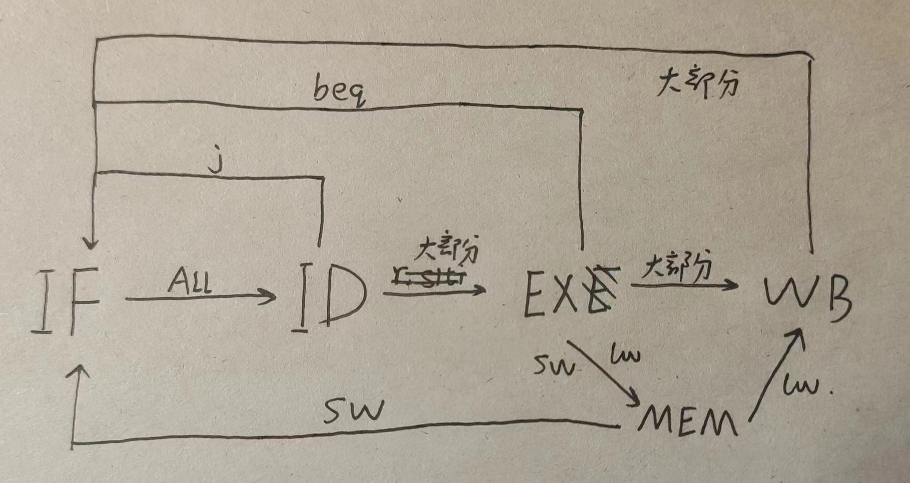
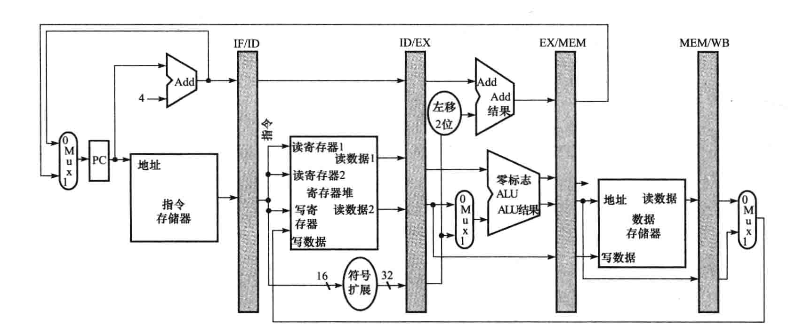

# 流水线CPU设计与实现

## 一、流水线CPU的初步设计

### 1.初步多周期设计

因为MIPS设计的规范性，MIPS代码在执行过程中可以较为轻松地拆结成多个部分。这里采用常见地五级流水线拆分方式。各级流水线拆分地含义如下表所示。

| IF           | ID                       | EX      | MEM                           | WB                               |
| ------------ | ------------------------ | ------- | ----------------------------- | -------------------------------- |
| 取指令并译码 | 根据译码决定是否读寄存器 | ALU运算 | 根据译码决定是否要读/取DM内容 | 根据译码决定是否将结果写入寄存器 |

因为流水线CPU的特性，CPU会出现冒险，在下文中检查数据冒险与控制冒险中，检查任何有可能出现的冒险至关重要。不同于单周期与多周期CPU，实现所有MIPS指令所需要的数据冒险与控制冒险的排查工作量巨大，因此我们需要先把代码写出来，观察所有可能出现冒险的地方并为之调整，以便减少工作量。

我们这次实验需要实现冒泡排序，因此我先编写了一个冒泡排序的程序。

```assembly
.data
arr:
	.word 15,63,12,1,5,2,41,32,6,10

.text
nop
la $a0, arr
li $s0, 0 #i
	loop1:
		slti $t0, $s0, 9
		beq $t0, $zero, exit1
		li $s1, 0
		li $t0, 9
		sub $s2, $t0, $s0
		j loop2
		
		loop2:
		slt $t0, $s1, $s2 #if(j<9-i)
		beq $t0, $zero, exit2
		sll $t0, $s1, 2
		add $t1, $a0, $t0
		lw $t2, 0($t1)
		lw $t3, 4($t1)
		slt $t4, $t3, $t2
		addi $s1, $s1, 1
		beq $t4, $zero, loop2
		sw $t3, 0($t1)
		sw $t2, 4($t1)
		j loop2
	
	exit2:
		addi $s0, $s0, 1
		j loop1
	exit1:
```

其中，在MARS里将初始设置成如下。我将根据代码段和数据段的预设位置来编写Verilog代码。这里我将代码段设置为从0开始，数据段从0x0002000开始，这样编写代码时可以直接将这个程序的机器码导入进仿真，只要对DM代码稍作调整就能正确执行仿真。


设置好初始设置之后，我们将源代码编译，得到下列实际代码。


根据编译得到的代码，我列出了所有需要用到的指令。

| R型指令 | I型指令 | J型指令 | 自制指令 |
| ------- | ------- | ------- | -------- |
| add     | addi    | j       | halt     |
| slt     | addiu   |         |          |
| sub     | slti    |         |          |
| sll     | beq     |         |          |
|         | lw      |         |          |
|         | sw      |         |          |

在这里halt的定义如下。

| 指令 | 机器码     | 含义                                                |
| ---- | ---------- | --------------------------------------------------- |
| halt | 0xffffffff | 让CPU停止运行，保留上一条指令执行完之后的所有结果。 |

因此，流水线CPU大致的设计思想如下。



从这里可以发现，从IF循环一周的时间中，j指令只需要前两个时钟周期的内容，beq需要前三个时钟周期的内容，sw需要前四个时钟周期的内容，lw与大部分指令需要用到所有五个时钟周期的内容。这为我们发现冒险提供了帮助。

同时，在单周期中使用的控制信号仍然能够运用在流水线CPU中。

| 信号名                    | 取0                        | 取1                                  | 使用位置 |
| ------------------------- | -------------------------- | ------------------------------------ | -------- |
| RegDst                    | 写入寄存器rt（20-16）      | 写入寄存器rd（15-11）                | EX       |
| RegWrite                  | 无                         | 写入由写入寄存器输入端口指定的寄存器 | WB       |
| ALUSrc                    | 第二个ALU操作数来自寄存器2 | 第二个ALU操作数来自立即数            | EX       |
| PCSrc(由Branch与zero得出) | PC+4                       | PC用分支地址更新                     | WB       |
| MemRead                   | 无                         | 取数据存储器内容到输出端口           | MEM      |
| MemWrite                  | 无                         | 将数据写入存储器                     | MEM      |
| MemtoReg                  | ALU写入寄存器              | 数据存储器写入寄存器                 | WB       |
| Branch                    | 不跳转                     | 跳转                                 | EX       |
| ALUop                     |                            |                                      | EX       |
| Jump                      | 不直接跳转                 | 直接跳转                             | ID       |

根据上述控制信号含义，同时查询MIPS指令表，我们可以得到所有指令的控制信号表。

| 指令操作码 | opcode | RegDst | ALUSrc | MemtoReg | RegWrite | MemRead | MemWrite | Branch | Jump | ALUOp1 | ALUOp2 |
| ---------- | ------ | ------ | ------ | -------- | -------- | ------- | -------- | ------ | ---- | ------ | ------ |
| r-type     | 0      | 1      | 0      | 0        | 1        | 0       | 0        | 0      | 0    | 1      | 0      |
| slti       | ah     | 0      | 1      | 0        | 1        | 0       | 0        | 0      | 0    | 1      | 1      |
| addi       | 8h     | 0      | 1      | 0        | 1        | 0       | 0        | 0      | 0    | 0      | 0      |
| addiu      | 9h     | 0      | 1      | 0        | 1        | 0       | 0        | 0      | 0    | 0      | 0      |
| beq        | 4h     | x      | 0      | x        | 0        | 0       | 0        | 1      | 0    | 0      | 0      |
| lw         | 23h    | 0      | 1      | 1        | 1        | 1       | 0        | 0      | 0    | 0      | 0      |
| sw         | 2bh    | x      | 1      | x        | 0        | 0       | 1        | 0      | 0    | 0      | 0      |
| j          | 2h     | x      | x      | x        | x        | x       | x        | x      | 1    | x      | x      |
| halt       | 2fh    | x      | x      | x        | 0        | 0       | 0        | 0      | 0    | x      | x      |

其中，ALUOp与funct机器码段能决定ALUControl，进而决定ALU的动作。同样通过MIPS指令表，能够得到相应的ALU表。

| 指令操作码 | ALUOp | funct  | ALU动作 | ALUControl |
| ---------- | ----- | ------ | ------- | ---------- |
| lw         | 00    | -      | add     | 0010       |
| sw         | 00    | -      | add     | 0010       |
| beq        | 01    | -      | sub     | 0110       |
| add        | 10    | 100000 | add     | 0010       |
| slt        | 10    | 101010 | slt     | 0111       |
| sub        | 10    | 100010 | sub     | 0110       |
| sll        | 10    | 000000 | <<2     | 0011       |
| slti       | 11    | -      | slt     | 0111       |
| addi       | 00    | -      | add     | 0010       |
| addiu      | 00    | -      | add     | 0010       |

### 2.流水线寄存器设计

因为流水线设计中一个时钟周期内会有不同指令在执行，进行到每一步都会改变相应的控制信号、寄存器地址等等关键值，所以每一级模块中都需要插入相对应的流水线模块。一种简单易懂的做法是直接在单周期CPU的基础上在每个模块之间插入，同时想清楚什么模块在什么地方。依照这个思想制作初步的流水线CPU设计。


一共需要插入的流水线寄存器如下。

1. **IFandID**：存储读到的指令与PC+4的结果。PC+4最后要传到EX模块中与beq地址作比较后传回给IF。

2. **IDandEX**：这个寄存器需要转送PC+4的内容。同时，读数据1与读数据2，还有符号扩展完的数（有可能是立即数运算，也有可能是偏移量）要传给EX，在EX中做ALUsecond的判断。同时，指令本身要完整传到EX中，方便后续提取相应数据利用。

3. **EXandMEM**：在EX中需要完成ALU的操作与beq偏移量的确定。ALU运算的结果会影响beq是否决定跳转，结果会直接传给IF判断是否要改变PC值。因此这里可以发现，beq的出现会造成控制冒险，我会在后面的流水线冒险章节中讨论解决办法。这个寄存器需要存储算出来的beq跳转地址，ALU计算结果与zero标志位，同时读数据2的值可能要写进数据存储器中，因此也要传递。最后仍然要把指令继续传递下去。

   **还有一个必须要注意的，这个地方会发生数据冒险。为了设置旁路，我们需要在这个地方就算出来ALU刚算出来的结果到底要写到哪个寄存器。同时RegWrite对判断是否出现数据冒险有用，因此也要存下来，具体思路在下文有提到。**

4. **MEMandWB**：MEM完成数据的读写，因此要保存其读出来的数据，同时也有可能不对数据存储器进行任何操作，所以也要把ALU的运算结果写进去。最后传输到WB之后，WB需要这个寄存器中存储的指令判断到底要写到哪个寄存器，以及写入什么值到寄存器堆中。

其中的注意事项：

1. 所有的读出流水线寄存器操作都在CPU时钟周期的上升沿，所有写入流水线寄存器的操作都在CPU时钟周期的下降沿，这样能避免写入写出的混乱，保证所有寄存寄存器值的更新都是统一的。具体到Verilog的代码中，则是所有output在时钟上升沿在相应的模块进行运算，存储在相应的下一个寄存器中，然后在时钟下降沿时把所有的input写进当前的寄存器中。
1. 此次实验只做了一个Control来让指令翻译成控制信号，因此必须搞清楚每一个寄存器应该保存哪些控制信号，以减少工作量。

最后可以列一个初步的表格，确定流水线寄存器存储的内容。

| 寄存器   | 存储内容                                                     |
| -------- | ------------------------------------------------------------ |
| IFandID  | PC4，指令                                                    |
| IDandEX  | PC4，指令，数据12，扩展符号数，控制信号                      |
| EXandMEM | 地址，ALU结果，zero，指令，写入寄存器的编号，RegWrite，控制信号 |
| MEMandWB | DM数据，ALU结果，写入寄存器的编号，RegWrite，控制信号        |

## 二.流水线冒险问题

与多周期CPU不同，流水线CPU需要在一个时间周期中执行所有阶段的工作，因此会出现在下一个时钟周期中某一条正在执行的指令没办法执行，被称为冒险。

为了彻底了解冒险发生的根本原因，我们要从最初级的流水线CPU的图像了解。



所有从左向右的流程都不会影响流水线，只有从右向左的箭头，也就是“写回”过程会让下一条指令的执行造成问题，也就是造成流水线冒险。因此根据上图可以发现：

1. 从WB到ID的写回存储跟不上下一条指令的需求是造成数据冒险的根本原因。
2. MEM到IF的写回判断跟不上下一条指令的需求是造成控制冒险的根本原因。

因此我们在排查可能出现的冒险时，只需要检查需要用到这两条通路的所有指令在代码中是否对后续代码造成影响即可

因为冒险的复杂性，设计时要清楚写出三类冒险类型，并且检查出代码中所有的冒险情况，并加以调整。

### 1. 结构冒险

硬件在某个时候无法执行相应地操作，比如寄存器堆同时需要取指令与写入指令。但是因为MIPS设计严谨，寄存器数量足够，同时根据五级流水线地拆分方法，结构冒险可以非常容易被避免。经过排查，这次流水线设计中没有出现结构冒险的可能性。

### 2. 数据冒险

因为一个指令需要未执行完的上一条指令的寄存器数据或存储器数据，造成数据冒险。解决数据冒险的方法有多种，在这里我们使用**旁路**与**流水线阻塞**的方法来解决。对于某些需要的结果只和上一条指令执行到的位置相差一个时钟周期的结果，我们可以启用旁路，将前一个指令刚得到的中途结果立刻送给发生冒险的指令来解决冒险。如果相差两个及以上的时间周期，需要使用流水线阻塞，强行停止这条指令的运作，直到结果得到满足。

数据冒险产生的根本原因在于运算好的值尚未被写入寄存器中就要被读出使用。因此这种冒险出现的频率很高。但是经过对代码的校验，这种冒险在本次的案例中只有两种情况。（数据冒险的处理是一个复杂的工作，可能出现的情况并不止本例中出现的两种）

1. **EX运算值未及时写入造成的冒险**

   这种冒险只有两种可能，如下图所示。

   > （该处图片已丢矢）

   用书上的公式讲述的话，就是

   $1a. EX/MEM.Rd=ID/EX.Rs$

   $1b. EX/MEM.Rd=ID/EX.Rt$

   $2a. MEM/WB.Rd=ID/EX.Rs$

   $2b. MEM/WB.Rd=ID/EX.Rt$

   即在同一个时钟周期中，当检测到$EX/MEM$或$MEM/WB$写入目标寄存器（既可以是Rd也可以是Rt，取决于指令类型是什么）与$ID/EX$中任何一个需要使用的寄存器相同时，就会发生冲突。

   这样的冲突使用**旁路**来解决。

   我们在EX中就已经算出来了Rtarget是什么，因此我们只要同时满足：

   1. $EX/MEM$或$MEM/WB$的Rtarget不是0，即不是0号寄存器。
   2. $EX/MEM$或$MEM/WB$的RegWrite=1。
   3. $ID/EX$中Rt/Rs=Rtarget（R型指令下），Rs=Rtarget（I型指令下）

   就可以判断发生了冒险，需要启用旁路。

   因此我们还需要在EX内设计一个判断器，初步设计如下。

   

   输入的值为Opcode, Rs, Rt, Rtarget。做两个这样的单元，分别判断EX/MEM与MEM/WB的不同。同时设立一个Forw表，用作多路选择器的控制信号。表的含义如下。

   | Forw值 | 来源       | 含义                              |
   | ------ | ---------- | --------------------------------- |
   | 0      | ID/EX      | 操作数来自寄存器堆                |
   | 1      | MEM/WB/MEM | 操作数来自数据存储器或者前几次ALU |

   如果出现了I型命令，第二个操作数是立即数时，可以明显得知此时得到的Rt是无效的，因此只要检测到ALUSrc=1，就令Forw的值无效。具体来说就是在判断第二个ALU操作数该取哪一个时，先判断ALUSrc是否是1，不是再判断Forw的值。

   **注意：旁路不会影响数据最终写入到正确的寄存器中，旁路只是将来不及写入到寄存器的数据在流水线上继续跑动的同时送给需要的级别来避免后面的指令数据错误的情况。**

2. **MEM中的值未及时写入造成的冒险**

   这种情况专门针对lw指令。lw直到MEM级才能获取到真正的值，这个时候如果下一条指令就要读，MEM级与ID级相差了两个级别，没有办法通过旁路解决。在这种情况下，只能在ID级检测到有lw冒险时强行停止PC加4。因为我们对于beq指令与j指令的处理是ID一旦读到就立刻停止PC增加，因此我们无需考虑lw的PC停机会让吞掉前面beq指令与j指令算好的跳转地址。在停机指令执行之后，运行到MEM时，情况就变成了第一种冒险，即MEM级冒险，这个时候按照第一种冒险的处理方法就可以了。

   因此需要一个控制信号lwNop，在IF检测到lwNop时自动停止更新一次即可。同时，因为在MEM冒险时，此时旁路Mux判断器写入的值其实是在WB经过判断的值，因此这里不需要额外写多一个判断信号。

### 3. 控制冒险

因为一个指令需要未执行完的上一条指令的寄存器数据或存储器数据来做分支判断，造成控制冒险。在本次案例中，会造成控制冒险的指令是beq。在这里，解决方法是取出分支指令之后立刻阻塞流水线，直到流水线确定了分支指令的结果与下一条真正要执行的指令的地址。

最终的跳转确认是在EX级确定的（我为了方便操作，把最终判断放到了EX中进行），在ID处就可以读出是否有beq指令。因此可以直接在ID一检测到beq立刻停止PC更新，总共停止两次更新，第三次运行时beq指令运行到MEM级，此时已经运算出来跳转地址了，直接写入IF中，然后在时钟的下降沿将IF中的PC值写入IF/ID寄存器中就可以了。

因此需要一个控制信号beqNop，在IF检测到beqNop时自动停止更新一次即可。

### 4. J指令是否需要阻塞

J指令在书本上并未详细解释如何设计。因为在ID可以同时完成对J指令的检测与跳转地址的计算，因此在时钟上升沿把IF/ID的内容取出来运算，得到是j指令之后立刻把PC的值改成j指令的跳转地址（而不是+4）并且取出相应的指令，这样在时钟下降沿写进IF/ID的内容就是更新地址之后的指令，这样设计的话就不需要阻塞了。

## 三、完善流水线CPU设计

通过第二部分的分析，在此新增以下控制信号。

| 控制信号 | 来源 | 接入 | 含义                                        |
| -------- | ---- | ---- | ------------------------------------------- |
| Forw     | EX   | EX   | 判断操作数是否需要旁路                      |
| lwNop    | ID   | IF   | PC自动停止更新一次,同时向IF/ID中输入一次nop |
| beqNop   | ID   | IF   | PC自动停止更新两次,同时向IF/ID中输入一次nop |

对于新增的两个控制信号，新增以下控制信号表。

| 指令操作码 | lwNop | beqNop |
| ---------- | ----- | ------ |
| r-type     | 0     | 0      |
| slti       | 0     | 0      |
| addi       | 0     | 0      |
| addiu      | 0     | 0      |
| beq        | 0     | 1      |
| lw         | 1     | 0      |
| sw         | 0     | 0      |
| j          | 0     | 0      |
| halt       | 0     | 0      |

至此我们已经完成了全部的设计，以下是设想的各个需要实现的主要部件

| 部件      | 部件       |
| --------- | ---------- |
| PC        | Control    |
| IM        | ALUControl |
| Registers | SignExtend |
| ALU       | ForwJudge  |
| DM        | BlockJudge |
| IFandID   | IDandEX    |
| EXandMEM  | MEMandWB   |

## 四、各部件实现

为了实现仿真，在这里的所有代码都是没有接入外部输入输出的版本，也就是说没有办法直接烧写到板上，但是非常容易用来仿真的版本。在仿真结束之后我对这个项目创建了一个副本，修改成了可以用来直接烧写到板子上的版本。在实验报告后面我也有提及。

**后记：其实到后来我发现即使加了输入输出模块，流程都是一样的...是我多虑了**

### 1. IF级

IF级包括PC模块与IM模块。因为PC集成了众多判断，全部堆在一起实现难度挺大。因此我拆分成了几个部分：PCplus4以及PC模块本身。而在具体实现PC模块的过程中，关于怎么让PC自动更新，更新时同时对所有更新过的信号加以判断，我遇到了非常大的困难。在仿真过程中经常做不出想要的效果。最后无奈之下，我用一个单独的PCRe模块来实现时钟上升沿自动更新，然后在原本的PC模块改成只要有信号发生改变就重做判断，以此来实现跳转。

同时为了让时钟周期的间隔足够充足，同时也为了后来烧写在板上做准备，我还加了一个时钟分频模块。

#### 1.1 PCRe

```verilog
module PCRe(
    input CLK,
    input [31:0]PC_in,
    output reg [31:0]PC_out
    );
    
    initial begin
        PC_out=0;
    end
    always@(posedge CLK)begin
        PC_out<=PC_in;
    end
    
endmodule
```

#### 1.2 PC

```verilog
module PC(
    input CLK,
    input [31:0]PC,
    input start,
    input Jump,
    input Branch,
    input [31:0]JAdd,
    input ALUzero,
    input beqNop,
    input lwNop,
    input [31:0]BeqAdd,
    input [31:0]instruction,
    output reg [31:0]Address
    );
    
    initial begin
        Address=0;
    end
    
    always@(*) begin
    if(start==1) begin
        if( lwNop==1  || beqNop==1)Address <= PC;
        else if(instruction==32'hffffffff) Address<=Address;
        else begin
            if(Branch==1 && ALUzero==1) Address<=BeqAdd;
            else if(Jump==1) Address<=JAdd;
            else Address <= PC+4;
        end
    end
    end
endmodule
```

#### 1.3 PCplus4

```verilog
module PCplus4(
    input [31:0]PCin,
    output reg [31:0]PC4
    );
    
    always@(*) begin
        PC4 <= PCin+4;
    end
endmodule
```

#### 1.4 CLK_div

```verilog
module CLK_div #(parameter N=99)(
    input CLK,
    output CLKout
    );
    
    reg [31:0]count=0;
    reg out=0;
    
    always@(posedge CLK)begin
        if(count==N)begin
            count<=0;
        end
        else begin
            count<=count+1;
        end
    end
    
    always@(posedge CLK)begin
    if(count==N-1) out<=!out;
    end
    
    assign CLKout=out;
endmodule
```

#### 1.5 IM

这里要记得把从MARS导出来的十六进制文件导入进去。MARS的16进制机器码还需要用文本工具处理成每行只有两个十六进制数字，这样才能正确的导入数据。我的代码块机器码文件叫hexcode，没有后缀。

```Verilog
module IM(
    input [31:0]ReadAddress,
    input beqNop,
    input lwNop,
    output reg [31:0]Instruction
    );
    reg [7:0] memory[0:8'hff];
    
    initial begin
        $readmemh("D:/hexcode",memory,0);
    end
    
    always@(*) begin
        if(beqNop==1 || lwNop==1) Instruction <= 32'h7fffffff;
        else begin 
         Instruction[31:24] <= memory[ReadAddress];
             Instruction[23:16] <= memory[ReadAddress+1];
             Instruction[15:8] <= memory[ReadAddress+2];
             Instruction[7:0] <= memory[ReadAddress+3];
        end
    end
    
       
endmodule
```

hexcode文件处理之后如下。

```assembly
00
00
00
00
00
00
00
00
00
00
00
00
20
04
20
00
24
10
00
00
2a
08
00
09
11
00
00
12
24
11
00
00
24
08
00
09
01
10
90
22
08
00
00
0b
02
32
40
2a
11
00
00
0a
00
11
40
80
00
88
48
20
8d
2a
00
00
8d
2b
00
04
01
6a
60
2a
22
31
00
01
11
80
ff
f7
ad
2b
00
00
ad
2a
00
04
08
00
00
0b
22
10
00
01
08
00
00
05
ff
ff
ff
ff
```

最后一个是我自己加入的停机指令ffffffff。

 ### 2. IFandID寄存器

为了保证一个时钟周期只处理一次数据，所有的级间寄存器都要用时钟周期作为更新的依据。

```verilog
module IFandID(
    input CLK,
    input [31:0]PC4in,
    input [31:0]insin,
    output reg [31:0]PC4out,
    output reg [31:0]insout
    );
    
    always@(posedge CLK)begin
        PC4out<=PC4in;
        insout<=insin;
    end
endmodule
```

### 3. ID级

ID级需要一个JumpAdder对Jump指令的跳转地址进行运算，这样j指令就不需要阻塞或者旁路来处理冒险了。除此以外，还有Control，Registers，SignExtend模块也要放在这个级别中。

#### 3.1 JumpAdder

```verilog
module JumpAdder(
    input [25:0]JAdd26,
    input [31:0]CurPC,
    output reg [31:0]JAdd
    );
    
    always@(*) begin
        JAdd = JAdd26<<2;
        JAdd <= {CurPC[31:28],JAdd[27:0]};
    end
endmodule
```

#### 3.2 Control

```verilog
module Control(
    input [5:0]opcode,
    output reg RegDst,
    output reg Branch,
    output reg MemRead,
    output reg MemtoReg,
    output reg [1:0]ALUop,
    output reg MemWrite,
    output reg Jump,
    output reg ALUSrc,
    output reg RegWrite,
    output reg lwNop,
    output reg beqNop,
    output reg halt
    );
    
    always@(*) begin
        if(opcode==6'h23) begin //lw
            RegDst <= 0;
            ALUSrc <= 1;
            MemtoReg <= 1;
            RegWrite <= 1;
            MemRead <= 1;
            MemWrite <= 0;
            Branch <= 0;
            Jump <= 0;
            ALUop <= 2'b00;
            lwNop <= 1;
            beqNop <= 0;
        end
        if(opcode==6'h2b) begin //sw
            ALUSrc <= 1;
            RegWrite <= 0;
            MemRead <= 0;
            MemWrite <= 1;
            Branch <= 0;
            Jump <= 0;
            ALUop <= 2'b00;
            lwNop <= 0;
            beqNop <= 0;
        end
        if(opcode==6'h4) begin //beq
            ALUSrc <= 0;
            RegWrite <= 0;
            MemRead <= 0;
            MemWrite <= 0;
            Branch <= 1;
            Jump <= 0;
            ALUop <= 2'b01;
            lwNop <= 0;
            beqNop <= 1;
        end
        if(opcode==0) begin //rtype
            RegDst <= 1;
            ALUSrc <= 0;
            MemtoReg <= 0;
            RegWrite <= 1;
            MemRead <= 0;
            MemWrite <= 0;
            Branch <= 0;
            Jump <= 0;
            ALUop <= 2'b10;
            lwNop <= 0;
            beqNop <= 0;
        end
        if(opcode==6'h2) begin //j
            RegWrite <= 0;
            MemRead <= 0;
            MemWrite <= 0;
            Branch <= 0;
            Jump <= 1;
            lwNop <= 0;
            beqNop <= 0;
        end
        if(opcode==6'h8 || opcode==6'h9) begin //addi,addiu
            RegDst <= 0;
            ALUSrc <= 1;
            MemtoReg <= 0;
            RegWrite <= 1;
            MemRead <= 0;
            MemWrite <= 0;
            Branch <= 0;
            Jump <= 0;
            ALUop <= 2'b00;
            lwNop <= 0;
            beqNop <= 0;
        end
        if(opcode==6'hf || opcode==6'hd || opcode==6'ha || opcode==6'hb) begin //lui,ori,slti,sltiu
            RegDst <= 0;
            ALUSrc <= 1;
            MemtoReg <= 0;
            RegWrite <= 1;
            MemRead <= 0;
            MemWrite <= 0;
            Branch <= 0;
            Jump <= 0;
            ALUop <= 2'b11;
            lwNop <= 0;
            beqNop <= 0;
        end

        if(opcode==6'b111111) begin //halt
            RegWrite <= 0;
            MemRead <= 0;
            MemWrite <= 0;
            Branch <= 0;
            Jump <= 0;
            lwNop <= 0;
            beqNop <= 0;
            halt<=1;
        end
        
        
        if(opcode==6'h1f) begin //nop
                    RegWrite <= 0;
                    MemRead <= 0;
                    MemWrite <= 0;
                    Branch <= 0;
                    Jump <= 0;
                    lwNop <= 0;
                    beqNop <= 0;
                end
    end
endmodule
```

#### 3.3 Registers

```verilog
module Registers(
    input CLK,
    input [4:0]ReadReg1,
    input [4:0]ReadReg2,
    input [4:0]WriteReg,
    input [31:0]WriteData,
    input RegWrite,
    output reg [31:0]ReadData1,
    output reg [31:0]ReadData2
    );
    reg [31:0] regist[0:31];
    integer i;
    
    initial
    begin
        for(i=0; i<32; i=i+1)
            regist[i] = 0;
    end
    
    always@(*) begin
        if(RegWrite==1) begin
            regist[WriteReg] = WriteData;
        end
        ReadData1 <= regist[ReadReg1];
        ReadData2 <= regist[ReadReg2];
    end
    
endmodule
```

#### 3.4 SignExtend

```verilog
module SignExtend(
    input [15:0]Ins16,
    input [5:0]opcode,
    output reg [31:0] Ins32
    );
    
    always@(*) begin
        if(opcode==6'hf) Ins32 <= {Ins16,16'b0}; //lui
        else begin
            if(Ins16[15:15]==0)Ins32 <= {16'b0,Ins16};
            else Ins32 <= {16'hffff,Ins16};
        end
        
    end
endmodule
```

### 4. IDandEX寄存器

这个寄存器要把所有的控制信号全部传递过去，而在后面的模块中则需要按情况选择需要传输的控制信号。

```verilog
module IDandEX(
    input CLK,
    input [31:0]insin,
    input [31:0]PC4in,
    input [31:0]RD1in,
    input [31:0]RD2in,
    input [31:0]SEin,
    input RegDstin,
    input RegWritein,
    input ALUSrcin,
    input MemReadin,
    input MemWritein,
    input MemtoRegin,
    input Branchin,
    input [1:0]ALUOpin,
    output reg[31:0]ins,
    output reg[31:0]PC4,
    output reg[31:0]RD1,
    output reg[31:0]RD2,
    output reg[31:0]SE,
    output reg RegDst,
    output reg RegWrite,
    output reg ALUSrc,
    output reg MemRead,
    output reg MemWrite,
    output reg MemtoReg,
    output reg Branch,
    output reg [1:0]ALUOp
    );
    
    always@(posedge CLK)begin
            ins<=insin;
            PC4<=PC4in;
            RD1<=RD1in;
            RD2<=RD2in;
            SE<=SEin;
            RegDst<=RegDstin;
            RegWrite<=RegWritein;
            ALUSrc<=ALUSrcin;
            MemRead<=MemReadin;
            MemWrite<=MemWritein;
            MemtoReg<=MemtoRegin;
            Branch<=Branchin;
            ALUOp<=ALUOpin;
    end
endmodule
```

### 5. EX级

EX级主要工作是做大部分运算。所有需要ALU结果的运算器都应该放在这个级别中。因此，beq指令的地址计算器BeqAdder要放在这个地方，也因此Beq需要一个阻塞来保证结果的正确运行。

同时，ALU的操作数不一定来自ID级，也有可能来自于旁路。因此在这个级别还要做相应的Frow信号控制器以及MuxFrow三路多选器。同时又因为第二个操作数的选择规则不一样，如果是I型指令就直接取立即数做运算，因此第一个数的MuxFrow和第二个数的MuxFrowSec有一些变化。

#### 5.1 BeqAdder

```verilog
module BeqAdder(
    input [31:0]SE,
    input [31:0]PC4,
    output reg [31:0]beqAdd
    );
    
    always@(*) begin
        beqAdd<=PC4+(SE<<2);
    end
endmodule
```

#### 5.2 ALUControl

```verilog
module ALUControl(
    input [1:0]ALUop,
    input [5:0]funct,
    input [5:0]opcode,
    output reg [3:0]ALUcontrol
    );
    
    always@(*) begin
        case(ALUop)
            2'b00: ALUcontrol<=4'b0010;
            2'b01: ALUcontrol<=4'b0110;
            2'b10: begin
                if(funct==6'b100000) ALUcontrol<=4'b0010;  //add
                else if(funct==6'b100010) ALUcontrol<=4'b0110; //sub
                else if(funct==6'b100100) ALUcontrol<=4'b0000;  //and
                else if(funct==6'b100101) ALUcontrol<=4'b0001;  //or
                else if(funct==6'b101010) ALUcontrol<=4'b0111;  //slt
                else if(funct==6'h0) ALUcontrol<=4'b0011;  //sll
            end
            2'b11: begin
                if(opcode==6'hf) ALUcontrol<=4'b1111;  //lui
                else if(opcode==6'hd) ALUcontrol<=4'b0001;  //ori
                else if(opcode==6'ha) ALUcontrol<=4'b0111;  //slti
                else if(opcode==6'hb) ALUcontrol<=4'b0111;  //sltiu
            end
        endcase
    end
endmodule
```

#### 5.3 ALU

```verilog
module ALU(
    input [31:0] in0,
    input [31:0] in1,
    input [3:0] ALUcontrol,
    output reg [31:0] result,
    output zero
    );
    
    always@(*) begin
        case(ALUcontrol)
            4'b0010: result <= in0+in1;
            4'b0110: result <= in0-in1;
            4'b0000: result <= in0&in1;
            4'b0001: result <= in0|in1;
            4'b0111: result <=(in0<in1)?1:0;
            4'b0011: result <= in1<<2;
            4'b0100: result <= in0>>>in1;
            4'b1111: result <= in1;
            default: result <= 0;
        endcase
    end
    assign zero = (in0==in1)?1:0;
endmodule
```

#### 5.4 MuxWriteReg

```verilog
module MuxWriteReg(
    input [4:0]rt,
    input [4:0]rd,
    input RegDst,
    output reg [4:0]result
    );
    
    always@(*) begin
        if(RegDst==0) result <= rt;
        else result <= rd;
    end
    
endmodule
```

#### 5.5 ForwJudge

这个控制信号器对EXandMEM寄存器的数据和MEMandWB的数据都是通用的，因此可以使用两次。

```verilog
module ForwJudge(
    input [4:0]IDRs,
    input [4:0]IDRt,
    input [4:0]Rtarget,
    input RegWrite,
    output reg ForwA,
    output reg ForwB
    );
    
    always@(*) begin
        if(Rtarget!=0 && RegWrite==1)begin
            if(Rtarget==IDRs)  begin
                ForwA<=1;
                ForwB<=0;
            end
            if(Rtarget==IDRt) begin
                ForwA<=0;
                ForwB<=1;
            end
        end
        else begin
            ForwA<=0;
            ForwB<=0;
        end
    end
endmodule
```

#### 5.6 MuxForw

这是第一个数的多选器。

```verilog
module MuxForw(
    input [31:0] Data,
    input [31:0] EXData,
    input [31:0] MEMData,
    input EXForw,
    input MEMForw,
    output reg [31:0] Result
    );
    
    always@(*) begin
            Result = Data;
            if(EXForw==1) Result <= EXData;
            if(MEMForw==1) Result <= MEMData;
        end
    
endmodule
```

#### 5.7 MuxForwSec

这是第二个数的多选器。

```verilog
module MuxForwSec(
    input [31:0] Data,
    input [31:0] EXData,
    input [31:0] MEMData,
    input [31:0] SE,
    input EXForw,
    input MEMForw,
    input EXALUSrc,
    input MEMALUSrc,
    input IDALUSrc,
    output reg [31:0] Result
    );
    
    always@(*) begin
            Result = Data;
        if( IDALUSrc==1)
            Result = SE;
        
            if(EXForw==1 && EXALUSrc==0) Result <= EXData;
            else if(MEMForw==1 && MEMALUSrc==0) Result <= MEMData;
        
    end
    
endmodule
```

### 6. EXandMEM寄存器

```verilog
module EXandMEM(
    input CLK,
    input [31:0]insin,
    input [4:0]Rtargetin,
    input [31:0]RD2in,
    input [31:0]ALUrein,
    input MemWritein,
    input MemReadin,
    input MemtoRegin,
    input ALUSrcin,
    input RegWritein,
    output reg [31:0]ins,
    output reg [4:0]Rtarget,
    output reg [31:0]RD2,
    output reg [31:0]ALUre,
    output reg MemWrite,
    output reg MemtoReg,
    output reg MemRead,
    output reg ALUSrc,
    output reg RegWrite
    );
    
    always@(posedge CLK) begin
        ins<=insin;
        Rtarget<=Rtargetin;
        RD2<=RD2in;
        ALUre<=ALUrein;
        MemWrite<=MemWritein;
        MemtoReg<=MemtoRegin;
        MemRead<=MemReadin;
        ALUSrc<=ALUSrcin;
        RegWrite<=RegWritein;
    end
    
endmodule
```

### 7. MEM级

MEM级主要是Data Memory的处理。往往在CPU中，因为外部存储的速度较慢，因此这个部分往往是耗时最久的。

#### 7.1 DM

为了便于仿真，这里我也导入了预先处理好的数据文件hexdata。

```verilog
module DM(
    input CLK,
    input [31:0]Address,
    input [31:0]WriteData,
    input MemRead,
    input MemWrite,
    output reg [31:0]ReadData
    );
    reg [7:0] ram[0:100];
    integer i;
    integer j=0;
    reg tem;
    
    //此次实验使用的data地址为0x00002000
    
    initial begin
        $readmemh("D:/hexdata",ram);
    end
    
    always@(*) begin
        if(MemRead==1) begin
            ReadData[31:24] <= ram[Address-32'h00002000];
            ReadData[23:16] <= ram[Address+1-32'h00002000];
            ReadData[15:8] <= ram[Address+2-32'h00002000];
            ReadData[7:0] <= ram[Address+3-32'h00002000];
        end
        
        if(MemWrite==1) begin
            ram[Address-32'h00002000] <= WriteData[31:24];
            ram[Address+1-32'h00002000] <= WriteData[23:16];
            ram[Address+2-32'h00002000] <= WriteData[15:8];
            ram[Address+3-32'h00002000] <= WriteData[7:0];
        end
    end    
    
endmodule
```

hexdata文件也需要处理，处理后如下。

```assembly
00
00
00
0f
00
00
00
3f
00
00
00
0c
00
00
00
01
00
00
00
05
00
00
00
02
00
00
00
29
00
00
00
20
00
00
00
06
00
00
00
0a
```

### 8. MEMandWB寄存器

```verilog
module MEMandWB(    
    input CLK,
    input MemtoRegin,
    input [31:0]RMemin,
    input [31:0]ALUrein,
    input ALUSrcin,
    input RegWritein,
    input [4:0]Rtargetin,
    output reg MemtoReg,
    output reg [31:0]RMem,
    output reg [31:0]ALUre,
    output reg ALUSrc,
    output reg RegWrite,
    output reg [4:0]Rtarget
    );
    
    always@(posedge CLK) begin
        MemtoReg<=MemtoRegin;
        RMem<=RMemin;
        ALUre<=ALUrein;
        ALUSrc<=ALUSrcin;
        RegWrite<=RegWritein;
        Rtarget<=Rtargetin;
    end
endmodule
```

### 9. WB模块

这个模块的任务是将DM读出的数据与ALUresult进行比较后再根据控制信号决定是否写入寄存器。

#### 9.1 Mux2in32 

```verilog
module Mux2in32(
    input [31:0] Data1,
    input [31:0] Data2,
    input Sel,
    output reg [31:0] Result
    );
    
    always@(*) begin
        if(Sel == 0)
            Result <= Data1;
        else
            Result <= Data2;
    end
    
endmodule
```

### 10. Top文件

因为多了四个级存储器，Top文件的导线数量大增，这导致编写Top文件的代码数量大增，且途中很容易连错导线。Top文件是我除了PC模块以外找bug最多的地方。

```verilog
module Top(
    input CLK,
    input start
    );
    
    wire CLKout;
    wire [31:0]PCplus4out;
    wire Jump;
    wire lwNop;
    wire beqNop;
    wire halt;
    wire [31:0]CurAdd;
    wire [31:0]beqAdd;
    wire [3:0] ALUCon;
    wire ALUzero;
    wire FA1;
    wire FA2;
    wire FB1;
    wire FB2;
    wire [31:0]JAdd;
    wire [31:0]nextPC;
    
    wire [31:0]IFinsin;
    wire [31:0]IFPC4;
    
    wire [31:0]IDins;
    wire [31:0]IDPC4;
    wire [31:0]IDRD1;
    wire [31:0]IDRD2;
    wire [31:0]IDSE;
    wire IDRegDst;
    wire IDRegWrite;
    wire IDALUSrc;
    wire IDMemRead;
    wire IDMemWrite;
    wire IDMemtoReg;
    wire IDBranch;
    wire [1:0]IDALUOp;
    
    wire [31:0]EXins;
    wire [31:0]EXPC4;
    wire [4:0]EXRtarget;
    wire [31:0]EXSE;
    wire [31:0]EXRD1;
    wire [31:0]EXRD2;
    wire [31:0]EXALUre;
    wire EXMemWrite;
    wire EXMemRead;
    wire EXMemtoReg;
    wire EXALUSrc;
    wire EXRegDst;
    wire EXRegWrite;
    wire EXBranch;
    wire [1:0]EXALUOp;
    wire [31:0]EXRD1c;
    wire [31:0]EXRD2c;
    
    wire [31:0]MEMRMem;
    wire [31:0]MEMALUre;
    wire MEMMemtoReg;
    wire MEMALUSrc;
    wire [31:0]MEMins;
    wire [4:0]MEMRtarget;
    wire [31:0]MEMRD;
    wire MEMMemWrite;
    wire MEMMemRead;
    wire MEMRegWrite;
    wire [31:0]MEMMem;
    
    wire [31:0]WBins;
    wire [31:0]WBRMem;
    wire [31:0]WBALUre;
    wire WBALUSrc;
    wire WBMemtoReg;
    wire [31:0]WBre;
    wire WBRegWrite;
    wire [4:0] WBRtarget;

//IF

    CLK_div CLK_div_1(
        .CLK(CLK),
        .CLKout(CLKout)
    );
    
    PCRe PCRe_1(
    .CLK(CLKout),
            .PC_in(nextPC),
            .PC_out(CurAdd)
    );
    
    PC PC_1(
        .CLK(CLKout),
        .PC(CurAdd),
        .start(start),
        .Jump(Jump),
        . Branch(EXBranch),
        . JAdd(JAdd),
        . ALUzero(ALUzero),
        . beqNop(beqNop),
        . lwNop(lwNop),
        . BeqAdd(beqAdd),
        .instruction(IFinsin),
        .Address(nextPC)
        );
        

    PCplus4 PCplus4_1(
    . PCin(nextPC),
    . PC4(PCplus4out)
    );

    IM IM_1(
        .ReadAddress(nextPC),
        . beqNop(beqNop),
        . lwNop(lwNop),
        .Instruction(IFinsin)
    );

    IFandID IFandID_1(
    .CLK(CLKout),
    .PC4in(PCplus4out),
    .insin(IFinsin),
    .PC4out(IDPC4),
    .insout(IDins)
    );
    
//ID

    JumpAdder JumpAdder_1(
    . JAdd26(IDins[25:0]),
    . CurPC(PCplus4out),
    . JAdd(JAdd)
    );

    Control Control_1(
        .opcode(IDins[31:26]),
            .RegDst(IDRegDst),
            .  Branch(IDBranch),
            .  MemRead(IDMemRead),
            .  MemtoReg(IDMemtoReg),
            .  ALUop(IDALUOp),
            .  MemWrite(IDMemWrite),
            .  Jump(Jump),
            .  ALUSrc(IDALUSrc),
            .  RegWrite(IDRegWrite),
            .  lwNop(lwNop),
            .  beqNop(beqNop),
            .halt(halt)
            );

    Registers Registers_1(
        . CLK(CLKout),
        . ReadReg1(IDins[25:21]),
        . ReadReg2(IDins[20:16]),
        . WriteReg(WBRtarget),
        . WriteData(WBre),
        . RegWrite(WBRegWrite),
        .ReadData1(IDRD1),
        .ReadData2(IDRD2)
        );

    SignExtend SignExtend_1(
    .Ins16(IDins[15:0]),
    .opcode(IDins[31:26]),
    .Ins32(IDSE)
    );
    
    IDandEX IDandEX_1(
    . CLK(CLKout),
    . insin(IDins),
    . PC4in(IDPC4),
    . RD1in(IDRD1),
    . RD2in(IDRD2),
    . SEin(IDSE),
    . RegDstin(IDRegDst),
    . RegWritein(IDRegWrite),
    . ALUSrcin(IDALUSrc),
    . MemReadin(IDMemRead),
    . MemWritein(IDMemWrite),
    . MemtoRegin(IDMemtoReg),
    . Branchin(IDBranch),
    . ALUOpin(IDALUOp),
    . ins(EXins),
    . PC4(EXPC4),
    . RD1(EXRD1),
    . RD2(EXRD2),
    . SE(EXSE),
    .  RegDst(EXRegDst),
    .  RegWrite(EXRegWrite),
    .  ALUSrc(EXALUSrc),
    .  MemRead(EXMemRead),
    .  MemWrite(EXMemWrite),
    .  MemtoReg(EXMemtoReg),
    .  Branch(EXBranch),
    .  ALUOp(EXALUOp)
    );
    
//EX

    BeqAdder BeqAdder_1(
    .SE(EXSE),
    .PC4(EXPC4),
    .beqAdd(beqAdd)
    );

    ALUControl ALUControl_1(
        .ALUop(EXALUOp),
        .funct(EXins[5:0]),
        .opcode(EXins[31:26]),
        .ALUcontrol(ALUCon)
    );

    ALU ALU_1(
        .in0(EXRD1c),
        .in1(EXRD2c),
        .ALUcontrol(ALUCon),
        .result(EXALUre),
        .zero(ALUzero)
    );
    
    MuxWriteReg MuxWriteReg_1(
        . rt(EXins[20:16]),
        . rd(EXins[15:11]),
        . RegDst(EXRegDst),
        .result(EXRtarget)
        );
        
    ForwJudge ForwJudgeEX(
        .IDRs(EXins[25:21]),
        .IDRt(EXins[20:16]),
        .Rtarget(MEMRtarget),
        .RegWrite(MEMRegWrite),
        .ForwA(FA1),
        .ForwB(FA2)
    );
    
     ForwJudge ForwJudgeMEM(
           .IDRs(EXins[25:21]),
           .IDRt(EXins[20:16]),
           .Rtarget(WBRtarget),
           .RegWrite(WBRegWrite),
           .ForwA(FB1),
           .ForwB(FB2)
       );

    MuxForw MuxForw1_1(
    . Data(EXRD1),
    . EXData(MEMALUre),
    . MEMData(WBre),
    . EXForw(FA1),
    . MEMForw(FB1),
    . Result(EXRD1c)
    );

    MuxForwSec MuxForw2_1(
    .  Data(EXRD2),
    .  EXData(MEMALUre),
    .  MEMData(WBre),
    .SE(EXSE),
    . EXForw(FA2),
    . MEMForw(FB2),
    . EXALUSrc(MEMALUSrc),
    . MEMALUSrc(WBALUSrc),
    . IDALUSrc(EXALUSrc),
    . Result(EXRD2c)
    );

    EXandMEM EXandMEM_1(
        .CLK(CLKout),
        .insin(EXins),
        .Rtargetin(EXRtarget),
        .RD2in(EXRD2),
        .ALUrein(EXALUre),
        .MemWritein(EXMemWrite),
        .MemReadin(EXMemRead),
        .MemtoRegin(EXMemtoReg),
        .ALUSrcin(EXALUSrc),
        .RegWritein(EXRegWrite),
        .ins(MEMins),
        .Rtarget(MEMRtarget),
        .RD2(MEMRD),
        .ALUre(MEMALUre),
        .MemWrite(MEMMemWrite),
        .MemtoReg(MEMMemtoReg),
        .MemRead(MEMMemRead),
        .ALUSrc(MEMALUSrc),
        .RegWrite(MEMRegWrite)
    );
    
//MEM

    DM DM_1(
    . CLK(CLKout),
    . Address(MEMALUre),
    . WriteData(MEMRD),
    . MemRead(MEMMemRead),
    . MemWrite(MEMMemWrite),
    .ReadData(MEMMem)
    );

    MEMandWB MEMandWB_1(    
    . CLK(CLKout),
    . MemtoRegin(MEMMemtoReg),
    . RMemin(MEMMem),
    . ALUrein(MEMALUre),
    . ALUSrcin(MEMALUSrc),
    . RegWritein(MEMRegWrite),
    .Rtargetin(MEMRtarget),
    .  MemtoReg(WBMemtoReg),
    .  RMem(WBRMem),
    .  ALUre(WBALUre),
    .  ALUSrc(WBALUSrc),
    . RegWrite(WBRegWrite),
    .Rtarget(WBRtarget)
    );

//WB

    Mux2in32 MuxWB(
    . Data1(WBALUre),
    . Data2(WBRMem),
    . Sel(WBMemtoReg),
    . Result(WBre)
    );

endmodule
```

## 五、仿真

### 1. 仿真文件

因为上面的代码是易于仿真的版本，因此仿真文件编写只需要编写CLK与start指令就可以了。start设为1以保证仿真正常运行。

```verilog
`timescale 1ns / 1ps
//////////////////////////////////////////////////////////////////////////////////
// Company: 
// Engineer: 
// 
// Create Date: 2023/12/09 00:10:16
// Design Name: 
// Module Name: Top_tb
// Project Name: 
// Target Devices: 
// Tool Versions: 
// Description: 
// 
// Dependencies: 
// 
// Revision:
// Revision 0.01 - File Created
// Additional Comments:
// 
//////////////////////////////////////////////////////////////////////////////////


module Top_tb(
    );
    reg CLK;
    reg start;
    
    initial begin
        CLK=0;
        start=1;
    end
    
    always begin
        #10
        CLK<=0;
        #10
        CLK<=1;
    end
    
    Top top_1(
        .CLK(CLK),
        .start(start)
    );
    
endmodule
```

### 2. 仿真过程

#### 2.1 验证寄存器之间是否有逐步推进运行

我们把PC的Address与每一个寄存器的ins都拿出来，看看指令有没有按照时钟来一个个传递下去。因为MEMandWB模块没有传输指令数据，因此这里直接把整个寄存器模块贴上去。

运行之后波形图如下。


结果看上去不错，能显著发现红色区域（即非赋值部分）有梯度趋势。接下来检查ins之间信号是不是传递的。


可以看到，第一个指令2004200很好地被传递下去了。

#### 2.2 验证排序是否能正常进行

因为我们的原数据很小，都是存在低八位，因此我们直接把DM的$4n-1$存储位贴在仿真上。

首先启动仿真。


原数据都很好的赋值了。且可以看到，后面的数据正在进行切换，说明冒泡排序正在有效地运行。接下来我们运行到结束。把PC模块加入观察，若Instruction最终停在ffffffff并保持不变化地话，就说明冒泡排序能够很好地运作并正常结束运行。


从这张仿真结果，我们可以看到，最终地结果很好完成了排序，同时Address停在了64，Instruction停在了`ffffffff`中。说明排序完美结束了。这个CPU正常运行了冒泡排序，所有地指令都正确地执行了。可喜可贺！

接下来我们验证这个流水线CPU拥有的旁路与阻塞的特性，同时也是为了自证这个仿真图片是流水线CPU跑起来的而不是由单周期CPU截图过来的。

#### 2.3 验证旁路

我们再来看我们的代码文件。


该代码中有非常多的旁路案例，我此处取最先出现的旁路作为案例，即这两行代码（请注意我取的是Basic区域的真代码，而不是右边区域的伪代码）。

```assembly
addiu $8,$0,0x0000009
sub $18,$8,$16
```

其实最上面还有两行代码也发生了冒险，但是为了更好地反映出旁路有在正确执行，我选择了需要使用数据并不为0的寄存器的代码。

这两行代码的Address如下。

```assembly
0x00000020
0x00000024
```

Code如下。

```assembly
0x24080009
0x01109022
```

我们把所有数据添加到仿真界面中运行。


这个界面称不上友好，因此我会把关键数据挑出来做进一步解释。

我们把EX级的ins拿出来，找到`0x24080009`处与`0x01109022`处的代码，并检查此时的ALU的值。


可以看到在`0x24080009`处，ALU取的值都是正确的值，运算结果正确，为9。


在`0x01109022`处，可以观察`in0`的取值，可以发现也是9。我们此时观察相对应的寄存器的值，也就是`$8`与`$16`的值


可以发现，此时寄存器`$8`的值还是1，直到这条指令之后寄存器才写入了9。这说明，旁路发挥了作用！

我们来看一看MuxFrow与FrowJudge是否发挥了作用。


首先看一看FrowJudge。很明显，IDRs与Rtarget发生了冲突，因此ForwA，也就是第一个操作数的EX级旁路控制信号变成了1。


再看一看MuxFrow。因为是第一个操作数发生冲突，我们不查看MuxFrowSec。可以看到，Data取了还未更替的值1，EXData取了刚运算的ALU值9。在EXForw的影响下，最终MuxFrow选择了EXData，也就是取了9这个值送入ALU中。

这个案例说明旁路确实按照逻辑很好地解决了数据冒险

#### 2.4 验证阻塞

##### 2.4.1 lw指令的阻塞

我们取一个lw指令，其Code与Address分别如下。

```assembly
lw $10,0x00000000($9)
0x8d2a0000
0x0000003c
```

观察其Address值。


可以发现，在`0x8d2a0000`处，紧接着下一条指令是`7fffffff`，也就是我设定好的空指令的值，同时Address保持不变，也就是PC停止了加四的操作。说明lw阻塞正常地运作了。

##### 2.4.2 beq指令的阻塞

我们取一个beq指令，其Code与Address分别如下。

```assembly
beq $8,$0,0x00000012
0x11000012
0x00000018
```

观察其Address值。


可以发现，在`0x11000012`处，紧接着下一条指令是`7fffffff`，也就是我设定好的空指令的值，同时Address保持不变，也就是PC停止了加四的操作。说明beq阻塞正常地运作了。同时我们发现这个指令没有发生跳转。为了验证即使是跳转也能够正常执行，我找到了一个跳转了的指令。这个指令并非一定会跳转，只是我刚好找到了这个指令跳转的时候。

其Code与Address分别如下。

```assembly
beq $12,$0,0xfffffff7
0x1180fff7
0x0000004c
```

首先我们先算出如果要跳转，会跳转到哪里。通过源代码文件我们已经知道如果验证通过，这个地址会跳转到`0x0000002c`。我们再手算验证一遍。


确认是`0x0000002c`。

我们再来看一看仿真波形。


可以看到，在经历了一次阻塞之后，Address正确地跳转到了`0x0000002c`的位置。因此，无论beq指令是否跳转，阻塞都发挥了正确的作用。

## 六、加入输入输出端口

为了能够烧写到板上，我们要修改Top文件，DM文件，PC文件，以及新增一些用来输入与显示的模块：Input，xianshi和LED。

### 1. 新增Input

```verilog
module Input(
    input CLK,
    input enter,
    input [15:0]InputNum,
    output reg [31:0] shuru
    );
    
    initial begin
        
    end
    
    always@(posedge CLK)begin
        if(enter==1) shuru<=InputNum;
    end
    

endmodule
```

### 2. 新增xianshi

```verilog
module xianshi(
    input realstart,
    input finish,
    input CLK,
    input [31:0] Data,
    output reg [3:0] seg,
    output reg [6:0] a_to_g
    );
    
    reg [3:0] temp;
    reg [7:0] x;
    
    initial begin
        temp=0;
        x=0;
    end
    
    always@(posedge CLK) begin
        case (temp)
                0: begin x = Data/4096; seg = 4'b0111; end
                1: begin x = Data/256%16; seg = 4'b1011; end
                2: begin x = Data/16%16; seg = 4'b1101; end
                3: begin x = Data%16; seg = 4'b1110; end
        endcase
        temp = temp + 1;
        if (temp == 4)
            temp = 0;
    end
    
    always@(*) begin
        if(realstart==1&&finish==0) a_to_g = 7'b0111111;
        else begin
            case (x)
                0: a_to_g = 7'b0000001;
                1: a_to_g = 7'b1001111;
                2: a_to_g = 7'b0010010;
                3: a_to_g = 7'b0000110;
                4: a_to_g = 7'b1001100;
                5: a_to_g = 7'b0100100;
                6: a_to_g = 7'b0100000;
                7: a_to_g = 7'b0001111;
                8: a_to_g = 7'b0000000;
                9: a_to_g = 7'b0000100;
                'hA: a_to_g = 7'b0001000;
                'hB: a_to_g = 7'b1100000;
                'hC: a_to_g = 7'b0110001;
                'hD: a_to_g = 7'b1000010;
                'hE: a_to_g = 7'b0110000;
                'hF: a_to_g = 7'b0111000;
                default: a_to_g = 7'b0000001;
            endcase
        end
    end
endmodule
```

### 3. 新增LED

```Verilog
module LED(
    input realstart,
    input CLK,
    input [4:0]regname,
    input finish,
    output reg [9:0] LED10,
    output reg LEDfinish
    );
    
    initial begin
        LEDfinish=0;
    end
    
    always@(posedge CLK)begin
        if(finish==0 && realstart==1) LED10=10'b0000000000;
        else begin
            case(regname)
                0:LED10=10'b1000000000;
                1:LED10=10'b0100000000;
                2:LED10=10'b0010000000;
                3:LED10=10'b0001000000;
                4:LED10=10'b0000100000;
                5:LED10=10'b0000010000;
                6:LED10=10'b0000001000;
                7:LED10=10'b0000000100;
                8:LED10=10'b0000000010;
                9:LED10=10'b0000000001;
            endcase
        end
        if(finish==1) LEDfinish=1;
    end
    
endmodule
```

### 4. 修改PC

```verilog
module PC(
    input CLK,
    input [31:0]PC,
    input start,
    input Jump,
    input Branch,
    input [31:0]JAdd,
    input ALUzero,
    input beqNop,
    input lwNop,
    input [31:0]BeqAdd,
    input [31:0]instruction,
    output reg [31:0]Address,
    output reg realstart,
    output reg finish
    );
    
    integer n;
    
    initial begin
        Address=0;
        realstart=0;
        finish=0;
    end
    
     always@(*)begin
           if(start==1) realstart=1;
       end
    
    always@(*) begin
    if(realstart==1) begin
        if(instruction==32'hffffffff) begin
            Address<=Address;
        end
        else if( lwNop==1  || beqNop==1)Address <= PC;
        else begin
            if(Branch==1 && ALUzero==1) Address<=BeqAdd;
            else if(Jump==1) Address<=JAdd;
            else Address <= PC+4;
        end
    end
    end
    
    always@(posedge CLK) begin
    if(instruction==32'hffffffff) finish<=1;
    else finish<=0;
    end
    
endmodule
```

### 5. 修改DM

```Verilog
module DM(
    input CLK,
    input realstart,
        input enter,
        input finish,
        input left,
        input right,
        input [31:0]shuru,
    input [31:0]Address,
    input [31:0]WriteData,
    input MemRead,
    input MemWrite,
    output reg [31:0]ReadData,
    output reg [31:0]curnum,
        output reg [4:0]regname
    );
    reg [7:0] ram[0:100];
    integer i;
    integer j=0;
    reg tem;
    
    //此次实验使用的data地址为0x00002000
    
    initial begin
       //$readmemh("D:/hexdata",ram);
       regname=0;
       tem=0;
  end
    
    always@(posedge CLK)begin
                if(left==1 && tem==0) begin
                    regname=regname-1;
                    if(regname>=10) regname=9;
                    tem<=1;
                end
                else if(right==1 && tem==0) begin
                    regname=regname+1;
                    if(regname>=10) regname=0;
                    tem<=1;
                end
                else if(left==0 && right==0 && tem==1) tem=0;
        end
        
        always@(posedge CLK)begin
            curnum[31:24]<=ram[regname*4];
            curnum[23:16]<=ram[regname*4+1];
            curnum[15:8]<=ram[regname*4+2];
            curnum[7:0]<=ram[regname*4+3];
        end
    
    always@(*) begin
        if(MemRead==1) begin
            ReadData[31:24] <= ram[Address-32'h00002000];
            ReadData[23:16] <= ram[Address+1-32'h00002000];
            ReadData[15:8] <= ram[Address+2-32'h00002000];
            ReadData[7:0] <= ram[Address+3-32'h00002000];
        end
    end
    
    always@(*) begin  
        if(MemWrite==1 && (enter!=1 || finish!=0)) begin
            ram[Address-32'h00002000] <= WriteData[31:24];
            ram[Address+1-32'h00002000] <= WriteData[23:16];
            ram[Address+2-32'h00002000] <= WriteData[15:8];
            ram[Address+3-32'h00002000] <= WriteData[7:0];
        end
        
        else if(enter==1 && finish==0)begin
                        ram[regname*4] <= shuru[31:24];
                        ram[regname*4+1] <= shuru[23:16];
                        ram[regname*4+2] <= shuru[15:8];
                        ram[regname*4+3] <= shuru[7:0];
                    end
    end    
endmodule
```

### 6. 修改Top

```Verilog
module Top(
    input CLK,
    input start,
    input enter,
    input left,
    input right,
    input [15:0]InputNum,
        output [9:0] LED10,
        output LEDfinish,
        output [3:0] seg,
        output [6:0] a_to_g
    );
    
    wire CLKout;
    wire [31:0]PCplus4out;
    wire Jump;
    wire lwNop;
    wire beqNop;
    wire halt;
    wire [31:0]CurAdd;
    wire [31:0]beqAdd;
    wire [3:0] ALUCon;
    wire ALUzero;
    wire FA1;
    wire FA2;
    wire FB1;
    wire FB2;
    wire [31:0]JAdd;
    wire [31:0]nextPC;
    
    wire [31:0]IFinsin;
    wire [31:0]IFPC4;
    
    wire [31:0]IDins;
    wire [31:0]IDPC4;
    wire [31:0]IDRD1;
    wire [31:0]IDRD2;
    wire [31:0]IDSE;
    wire IDRegDst;
    wire IDRegWrite;
    wire IDALUSrc;
    wire IDMemRead;
    wire IDMemWrite;
    wire IDMemtoReg;
    wire IDBranch;
    wire [1:0]IDALUOp;
    
    wire [31:0]EXins;
    wire [31:0]EXPC4;
    wire [4:0]EXRtarget;
    wire [31:0]EXSE;
    wire [31:0]EXRD1;
    wire [31:0]EXRD2;
    wire [31:0]EXALUre;
    wire EXMemWrite;
    wire EXMemRead;
    wire EXMemtoReg;
    wire EXALUSrc;
    wire EXRegDst;
    wire EXRegWrite;
    wire EXBranch;
    wire [1:0]EXALUOp;
    wire [31:0]EXRD1c;
    wire [31:0]EXRD2c;
    
    wire [31:0]MEMRMem;
    wire [31:0]MEMALUre;
    wire MEMMemtoReg;
    wire MEMALUSrc;
    wire [31:0]MEMins;
    wire [4:0]MEMRtarget;
    wire [31:0]MEMRD;
    wire MEMMemWrite;
    wire MEMMemRead;
    wire MEMRegWrite;
    wire [31:0]MEMMem;
    
    wire [31:0]WBins;
    wire [31:0]WBRMem;
    wire [31:0]WBALUre;
    wire WBALUSrc;
    wire WBMemtoReg;
    wire [31:0]WBre;
    wire WBRegWrite;
    wire [4:0] WBRtarget;

    wire [31:0] shuru;
    wire [31:0]curnum;
    wire realstart;
    wire finish;
    wire [4:0]regnum;
    
    
//       
    Input Input_1(
        .CLK(CLKout),
        .enter(enter),
        .InputNum(InputNum),
        .shuru(shuru)
    );

    xianshi xianshi_1(
        .CLK(CLKout),
        .Data(curnum),
        .seg(seg),
        .a_to_g(a_to_g),
        .realstart(realstart),
        .finish(finish)
        );

    LED LED_1(
        .CLK(CLKout),
        .regname(regnum),
        .finish(finish),
        .LED10(LED10),
        .realstart(realstart),
        .LEDfinish(LEDfinish)
        );
//IF

    CLK_div CLK_div_1(
        .CLK(CLK),
        .CLKout(CLKout)
    );
    
    PCRe PCRe_1(
    .CLK(CLKout),
            .PC_in(nextPC),
            .PC_out(CurAdd)
    );
    
    PC PC_1(
        .CLK(CLKout),
        .PC(CurAdd),
        .start(start),
        .Jump(Jump),
        . Branch(EXBranch),
        . JAdd(JAdd),
        . ALUzero(ALUzero),
        . beqNop(beqNop),
        . lwNop(lwNop),
        . BeqAdd(beqAdd),
        .instruction(IFinsin),
        .Address(nextPC),
        .realstart(realstart),
        .finish(finish)
        );
        

    PCplus4 PCplus4_1(
    . PCin(nextPC),
    . PC4(PCplus4out)
    );

    IM IM_1(
        .ReadAddress(nextPC),
        . beqNop(beqNop),
        . lwNop(lwNop),
        .Instruction(IFinsin)
    );

    IFandID IFandID_1(
    .CLK(CLKout),
    .PC4in(PCplus4out),
    .insin(IFinsin),
    .PC4out(IDPC4),
    .insout(IDins)
    );
    
//ID

    JumpAdder JumpAdder_1(
    . JAdd26(IDins[25:0]),
    . CurPC(PCplus4out),
    . JAdd(JAdd)
    );

    Control Control_1(
        .opcode(IDins[31:26]),
            .RegDst(IDRegDst),
            .  Branch(IDBranch),
            .  MemRead(IDMemRead),
            .  MemtoReg(IDMemtoReg),
            .  ALUop(IDALUOp),
            .  MemWrite(IDMemWrite),
            .  Jump(Jump),
            .  ALUSrc(IDALUSrc),
            .  RegWrite(IDRegWrite),
            .  lwNop(lwNop),
            .  beqNop(beqNop),
            .halt(halt)
            );

    Registers Registers_1(
        . CLK(CLKout),
        . ReadReg1(IDins[25:21]),
        . ReadReg2(IDins[20:16]),
        . WriteReg(WBRtarget),
        . WriteData(WBre),
        . RegWrite(WBRegWrite),
        .ReadData1(IDRD1),
        .ReadData2(IDRD2)
        );

    SignExtend SignExtend_1(
    .Ins16(IDins[15:0]),
    .opcode(IDins[31:26]),
    .Ins32(IDSE)
    );
    
    IDandEX IDandEX_1(
    . CLK(CLKout),
    . insin(IDins),
    . PC4in(IDPC4),
    . RD1in(IDRD1),
    . RD2in(IDRD2),
    . SEin(IDSE),
    . RegDstin(IDRegDst),
    . RegWritein(IDRegWrite),
    . ALUSrcin(IDALUSrc),
    . MemReadin(IDMemRead),
    . MemWritein(IDMemWrite),
    . MemtoRegin(IDMemtoReg),
    . Branchin(IDBranch),
    . ALUOpin(IDALUOp),
    . ins(EXins),
    . PC4(EXPC4),
    . RD1(EXRD1),
    . RD2(EXRD2),
    . SE(EXSE),
    .  RegDst(EXRegDst),
    .  RegWrite(EXRegWrite),
    .  ALUSrc(EXALUSrc),
    .  MemRead(EXMemRead),
    .  MemWrite(EXMemWrite),
    .  MemtoReg(EXMemtoReg),
    .  Branch(EXBranch),
    .  ALUOp(EXALUOp)
    );
    
//EX

    BeqAdder BeqAdder_1(
    .SE(EXSE),
    .PC4(EXPC4),
    .beqAdd(beqAdd)
    );

    ALUControl ALUControl_1(
        .ALUop(EXALUOp),
        .funct(EXins[5:0]),
        .opcode(EXins[31:26]),
        .ALUcontrol(ALUCon)
    );

    ALU ALU_1(
        .in0(EXRD1c),
        .in1(EXRD2c),
        .ALUcontrol(ALUCon),
        .result(EXALUre),
        .zero(ALUzero)
    );
    
    MuxWriteReg MuxWriteReg_1(
        . rt(EXins[20:16]),
        . rd(EXins[15:11]),
        . RegDst(EXRegDst),
        .result(EXRtarget)
        );
        
    ForwJudge ForwJudgeEX(
        .IDRs(EXins[25:21]),
        .IDRt(EXins[20:16]),
        .Rtarget(MEMRtarget),
        .RegWrite(MEMRegWrite),
        .ForwA(FA1),
        .ForwB(FA2)
    );
    
     ForwJudge ForwJudgeMEM(
           .IDRs(EXins[25:21]),
           .IDRt(EXins[20:16]),
           .Rtarget(WBRtarget),
           .RegWrite(WBRegWrite),
           .ForwA(FB1),
           .ForwB(FB2)
       );

    MuxForw MuxForw1_1(
    . Data(EXRD1),
    . EXData(MEMALUre),
    . MEMData(WBre),
    . EXForw(FA1),
    . MEMForw(FB1),
    . Result(EXRD1c)
    );

    MuxForwSec MuxForw2_1(
    .  Data(EXRD2),
    .  EXData(MEMALUre),
    .  MEMData(WBre),
    .SE(EXSE),
    . EXForw(FA2),
    . MEMForw(FB2),
    . EXALUSrc(MEMALUSrc),
    . MEMALUSrc(WBALUSrc),
    . IDALUSrc(EXALUSrc),
    . Result(EXRD2c)
    );

    EXandMEM EXandMEM_1(
        .CLK(CLKout),
        .insin(EXins),
        .Rtargetin(EXRtarget),
        .RD2in(EXRD2),
        .ALUrein(EXALUre),
        .MemWritein(EXMemWrite),
        .MemReadin(EXMemRead),
        .MemtoRegin(EXMemtoReg),
        .ALUSrcin(EXALUSrc),
        .RegWritein(EXRegWrite),
        .ins(MEMins),
        .Rtarget(MEMRtarget),
        .RD2(MEMRD),
        .ALUre(MEMALUre),
        .MemWrite(MEMMemWrite),
        .MemtoReg(MEMMemtoReg),
        .MemRead(MEMMemRead),
        .ALUSrc(MEMALUSrc),
        .RegWrite(MEMRegWrite)
    );
    
//MEM

    DM DM_1(
    . CLK(CLKout),
    .realstart(realstart),
    .enter(enter),
    .finish(finish),
    .left(left),
    .right(right),
    .shuru(shuru),
    . Address(MEMALUre),
    . WriteData(MEMRD),
    . MemRead(MEMMemRead),
    . MemWrite(MEMMemWrite),
    .ReadData(MEMMem),
    .curnum(curnum),
    .regname(regnum)
    );

    MEMandWB MEMandWB_1(    
    . CLK(CLKout),
    . MemtoRegin(MEMMemtoReg),
    . RMemin(MEMMem),
    . ALUrein(MEMALUre),
    . ALUSrcin(MEMALUSrc),
    . RegWritein(MEMRegWrite),
    .Rtargetin(MEMRtarget),
    .  MemtoReg(WBMemtoReg),
    .  RMem(WBRMem),
    .  ALUre(WBALUre),
    .  ALUSrc(WBALUSrc),
    . RegWrite(WBRegWrite),
    .Rtarget(WBRtarget)
    );

//WB

    Mux2in32 MuxWB(
    . Data1(WBALUre),
    . Data2(WBRMem),
    . Sel(WBMemtoReg),
    . Result(WBre)
    );

endmodule
```

至此，我们完成了所有的改动工作。

## 七、烧写效果

（该处图片已丢失，故略去这部分内容）

## 八、后记

终于完成了最后一个实验课作业，我不由得心中不少感慨。我直接跳过了多周期CPU的制作过程（因为多周期其实最终还是为了服务于流水线），直接开始上手做流水线CPU，因此我遇到了非常非常多困难。不过还好，终于挺过来了。

### 1. 最大的困难：时序问题

我在制作前完全没有想到，整个实验最困难的部分不是旁路与阻塞的具体实现，而是时序问题。这个问题体现得最明显的地方是：PC。

最开始时我把PC的按时序改变与按控制信号改变做在一起，发现完全不能正常运作。而后我找了无数的bug，最后定位在：PC并没有按照我的期望正常运作。因为我从来没有学习过一个正规可行的PC到底应该怎么实现，而且我查不到相关的资料。因此在长达三天的从早到晚的debug中，至少有两天是因为PC引发bug。相比之下，其他部分都有相关的资料参考，或者是不涉及时序问题，因此没有遇到PC那多样而奇怪的问题。

这样的问题发生在了很多地方，包括但不限于：级间寄存器的信号传递发生的时间与预期不符；信号还没有传递到就已经结束判断；最开始的PC运行并不是从0开始（我加入了几个nop指令来规避这个问题）等等。除此以外，还有always模块中的`*`用法并不能让人满意。比如在仿真debug的过程中，我发现finish信号会莫名奇妙的被赋1，最后才发现，在always模块中只要有一个信号发生改变，就会全部重做判断，结果刚好有一次branch与ALUzero全部为1，而BeqAdd的地址就恰好就是停机指令的位置（真是好巧不巧，在纯随机地情况下竟然能算出停机指令的位置，而且竟然成功跳转），finish就稀里糊涂地附上1了。

这让我开始思考时序问题的重要性。在CPU的设计中，我们理应不能被这种细枝末节的问题一直被折磨，但是这个细节处处存在，一直在困扰着我们写出正确的代码。我认为这个问题是因为我没有系统学习过Verilog这门语言，同时我没有数字电路基础，因此我吃了不少苦头。

### 2. 收获

这么一般痛苦的过程也并非没有收获。虽然我本人并不对CPU设计感兴趣，盯着数字信号调试的过程确实非常痛苦...但是我对操作系统，与编译原理很感兴趣。操作系统与编译器的优化很大程度上要基于CPU类型来进行优化，要了解当前CPU到底使用了什么周期模式，有什么技巧加快CPU运作速度，操作系统与编译器的优化才能落到实处。在学习了流水线CPU的工作模式，加上理论课上学习的存储器的工作模式与效率计算方法，为我学习操作系统与编译器的优化有了一个良好的基础。同样，这个优化CPU的过程，用流水线代替单周期，解决流水线的方法的优化思路也可以为操作系统与编译器的优化提供一些灵感与基础。

因为CPU的工作原理作为最为底层的知识之一，一切在CPU上层的bug无法解决的情况，理论上都可以通过检查CPU工作情况来解决。因此，设计流水线CPU并观察其工作，修改制作过程中的bug，极大提高了我debug能力，让我为以后学习计算机的知识打下了牢靠的基础。

### 3. 致谢

感谢助教的相关实验报告，同学的对我PC设计思路的启发，感谢计算机组成原理的作者编写了详细的设计CPU的流程，让我能少走不少弯路。我的单周期CPU与流水线CPU的设计思路来源于这本书，只在为了实现更多的指令而做了一些细微的改动，控制信号也严格按照本书给的信号表，规范化的设计让我在PC以外的其他部件设计方面少走了非常多的弯路。
